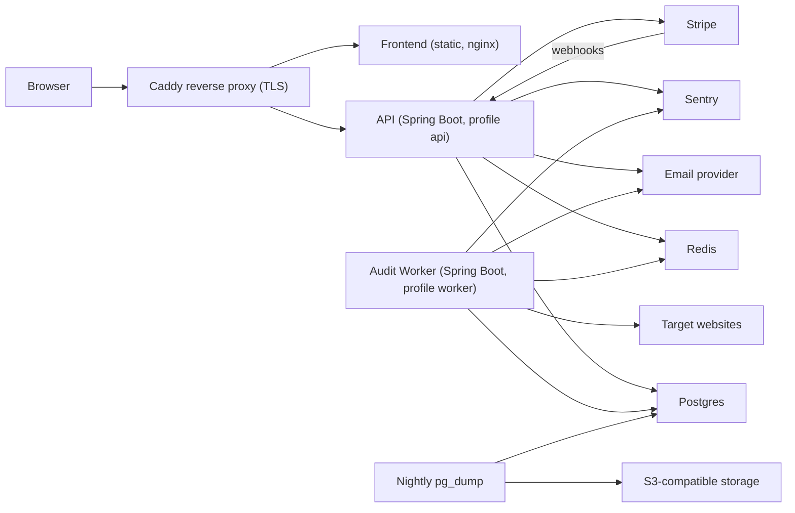
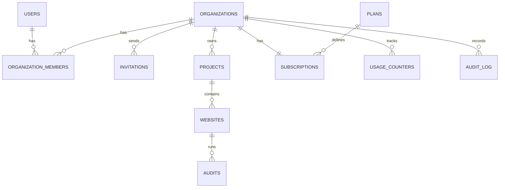
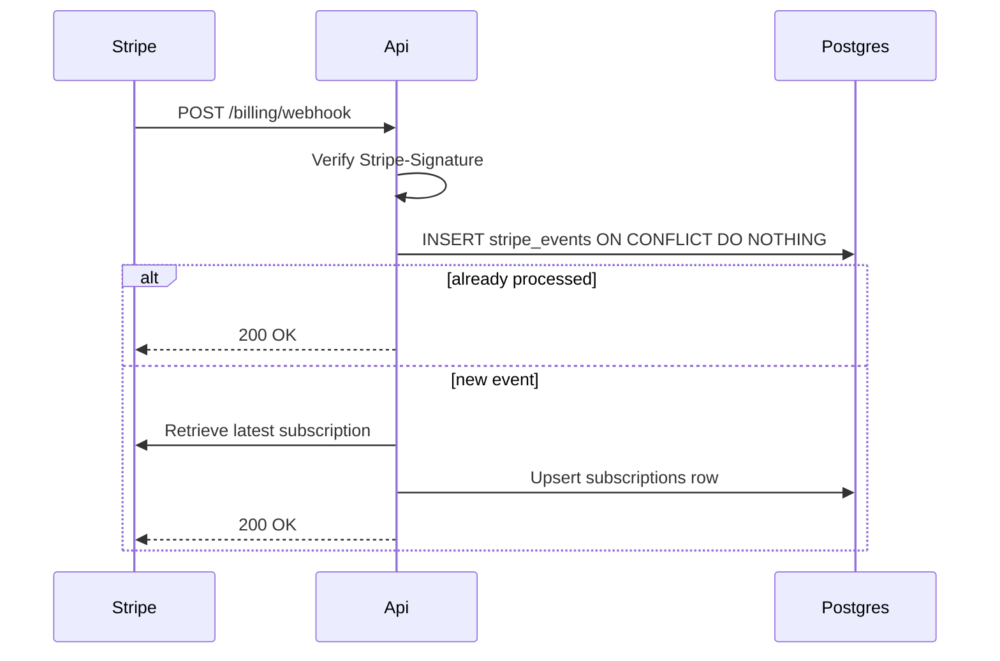
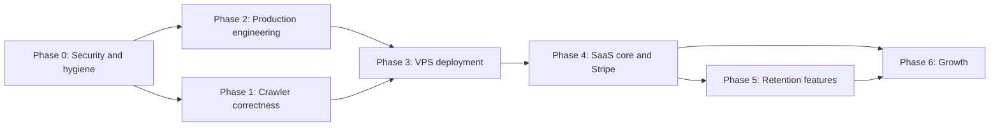

# SEOPulse Implementation Roadmap

This document turns the September 2026 codebase audit into a phase-by-phase plan for making SEOPulse a production-grade, subscription-based SaaS.

- **Billing provider:** Stripe
- **Hosting target:** Docker Compose on a single VPS (DigitalOcean, Hetzner or Lightsail), with a documented path to scale out later
- **Stack:** Spring Boot 4 / Java 25, PostgreSQL 17, Redis 8, React 19 + Vite + Tailwind 4

## Contents

1. [Current state](#current-state)
2. [Target architecture](#target-architecture)
3. [How to read each phase](#how-to-read-each-phase)
4. [Phase 0: Security and repo hygiene](#phase-0-security-and-repo-hygiene)
5. [Phase 1: Crawler correctness](#phase-1-crawler-correctness)
6. [Phase 2: Production engineering](#phase-2-production-engineering)
7. [Phase 3: Deployment on a VPS with Docker Compose](#phase-3-deployment-on-a-vps-with-docker-compose)
8. [Phase 4: SaaS core, with organizations, plans and Stripe](#phase-4-saas-core-with-organizations-plans-and-stripe)
9. [Phase 5: Retention features](#phase-5-retention-features)
10. [Phase 6: Growth and differentiation](#phase-6-growth-and-differentiation)
11. [Migration ledger](#migration-ledger)
12. [Definition of Done](#definition-of-done)
13. [Phase dependency order](#phase-dependency-order)
14. [Risks](#risks)

---

## Current state

### What already works well

- A clean package-by-feature layout in the backend: `auth`, `project`, `website`, `website.seo`, `common`.
- An asynchronous audit pipeline: `AuditService` writes an `AuditOutbox` row, `AuditOutboxPublisher` pushes it to a Redis Stream, and `AuditWorker` consumes it, with retry counts and recovery of stuck messages.
- SSRF protection (blocking URLs that resolve to private or internal networks) in `UrlValidator`, applied again to every discovered link and redirect.
- Pluggable analyzers behind the `SeoAnalyzer` interface: title, meta description, H1, canonical, links, images, content, HTTP status.
- Flyway migrations, `ddl-auto: validate` in `application.yml`, OpenAPI docs, and Actuator on the classpath.
- A polished React frontend with a landing page, onboarding handoff, dashboard, audits, issues, pages, settings, theming and client-side report export.

### What blocks production

| Area | Finding | Where |
|---|---|---|
| Security | Audit endpoints never check the current user, so any logged-in user can read or start audits in another user's project by guessing sequential IDs | `AuditController`, `AuditService` |
| Security | A real database password is committed, and `ddl-auto=update` overrides the `validate` setting | `seopulse-backend/src/main/resources/application.properties` |
| Data | No migration creates the `websites` table, and `V2` points its foreign key at a nonexistent `website` table. A fresh database fails at `V2`; the local DB only works because Hibernate created the table | `db/migration/V2__create_audits_table.sql` |
| Repo | `seopulse-backend` is a nested repo reference (mode 160000) with no `.gitmodules`, so cloning the root gives an empty backend folder | repo root |
| Crawler | Redirects are validated and then dropped, so `http://` or non-`www` sites crawl 0 pages | `WebsiteCrawler.crawlPage` |
| Crawler | `respect-robots-txt` and `concurrency` are configured but never read | `CrawlerProperties`, `WebsiteCrawler` |
| Scaling | The worker runs inside the API process with a hardcoded consumer name `worker-1` | `AuditWorker`, `AuditWorkerScheduler` |
| Quality | The only backend test is `contextLoads()`; the frontend has no tests; there is no CI | `src/test` |
| Delivery | No Dockerfiles for the app, and CORS is hardcoded to `localhost` | `SecurityConfig` |
| Business | No organizations, plans, billing, email, scheduling or usage limits | none |

---

## Target architecture



Key decisions:

- **One codebase, two runtime roles.** The API and the worker are the same Spring Boot artifact started with different profiles. The worker scales by adding containers, each with a unique Redis consumer name.
- **Organization as the tenant.** Every project, subscription and usage counter belongs to an organization. Users belong to organizations through memberships with roles.
- **Entitlements checked in one place.** Plan limits are enforced by a single `EntitlementService` before anything that consumes quota.
- **Stripe is the billing source of truth.** Local `subscriptions` rows are a cache that is updated only by verified, idempotent webhooks.

---

## How to read each phase

Every phase uses the same structure:

- **Goal:** what the phase achieves, in one sentence.
- **Tasks:** checkboxes naming the files or classes to add or change. Paths are relative to the repo root.
- **Schema / migrations:** the Flyway files the phase adds. See the [migration ledger](#migration-ledger) for the full numbering.
- **Exit criteria:** testable statements that must all be true before the phase is closed.
- **Estimate:** rough effort for one developer.

Backend paths use `BE` for `seopulse-backend/src/main/java/com/seopulse` and `FE` for `seopulse-frontend/src`.

---

## Phase 0: Security and repo hygiene

**Goal:** close the data-leak hole, remove committed secrets, and make the repository clone-able and the database reproducible from scratch.

**Estimate:** 3-4 days. This phase blocks all other phases.

### Tasks

**0.1 Fix audit ownership checks**

- [x] Inject `CurrentUserService` into `BE/website/controller/AuditController.java` and pass `userId` into every service call, the same way `WebsiteController` already does.
- [x] Add a `Long userId` parameter to every public method in `BE/website/service/AuditService.java`: `createAudit`, `getAudits`, `getAudit`, `getAuditPages`, `getAuditIssues`, `getAuditSummary`, `getLatestAudit`.
- [x] Add user-scoped lookups to `BE/website/repository/AuditRepository.java` and `WebsiteRepository.java`, and use them instead of `findById` followed by a manual project check:

```java
Optional<Audit> findByIdAndWebsiteProjectIdAndWebsiteProjectUserId(
        Long auditId, Long projectId, Long userId);

Optional<Website> findByIdAndProjectIdAndProjectUserId(
        Long websiteId, Long projectId, Long userId);
```

- [x] Extract a small `ProjectAccessService.requireOwnedProject(projectId, userId)` so the check lives in one place. Phase 4 changes it to an organization-membership check. (Also has `requireOwnedWebsite` and `requireOwnedAudit`; `ProjectService` and `WebsiteService` now use it too.)
- [x] Always return 404, never 403, for resources the caller doesn't own, so IDs can't be discovered by probing.
- [x] Review `ProjectController`, `WebsiteController` and any dashboard or summary endpoints for the same pattern.

**0.2 Remove committed secrets**

- [x] Delete `seopulse-backend/src/main/resources/application.properties`. It contains a real password and `spring.jpa.hibernate.ddl-auto=update`, which overrides `validate`.
- [x] Move `server.port: ${SERVER_PORT:8082}` into `application.yml`.
- [x] Add `application-local.yml` to `.gitignore` for personal overrides, and commit an `application-local.yml.example`. (Loaded through `spring.config.import`.)
- [ ] Rotate the local Postgres password that was committed. Treat it as compromised wherever else it was reused.
- [ ] Scrub history with `git filter-repo --path seopulse-backend/src/main/resources/application.properties --invert-paths`, then force-push once and ask any collaborators to re-clone. (The password is only in the old backend history, now backed up outside the repo at `../seopulse-backend.git-backup`; that history was never pushed. Scrub or delete the backup before sharing it.)
- [x] Make startup fail fast in the `prod` profile when `JWT_SECRET` is shorter than 32 bytes or `DB_PASSWORD` is the dev default. (`StartupConfigValidator`; also checks `CORS_ALLOWED_ORIGINS` in prod and the JWT secret length in every profile.)

**0.3 Make the database reproducible (baseline migration)**

No migration creates the `websites` table, and `V2__create_audits_table.sql` references `website (id)`, which doesn't exist. Because there is no production data yet, squash the migrations into one baseline:

- [x] Compare the entities against `V1`-`V10`. Also found: `V8` and `V9` were identical, `V6` named a column `recommendation` while the entity maps `recommendations`, and Flyway had never run at all because Spring Boot 4 needs `spring-boot-starter-flyway` (the pom only had `flyway-core`).
- [x] Write `V1__baseline_schema.sql` that creates `users`, `projects`, `websites`, `audits`, `audit_outbox`, `audit_pages` and `seo_issues`, with every index from `V7` and `V10`, correct foreign keys (`audits.website_id REFERENCES websites(id)`), and `ON DELETE CASCADE` where the code relies on it.
- [x] Delete `V1`-`V10`.
- [ ] Reset local databases (`docker compose down -v`, or drop and recreate a locally installed `seopulse` database).
- [x] Add a Testcontainers test that runs Flyway against an empty Postgres and boots the app with `ddl-auto=validate`. This becomes the permanent guard against schema drift. (`SeopulseBackendApplicationTests`; `application-test.yml` now uses `validate` instead of `create-drop`.)
- [x] Run the JVM in UTC (`main()` and Surefire), because Postgres 17 rejects the legacy `Asia/Calcutta` zone ID the driver sends on connect.

**0.4 Merge into a single monorepo**

- [x] Remove the gitlink: `git rm --cached seopulse-backend`, move `seopulse-backend/.git` to `../seopulse-backend.git-backup` (its 14 commits were never pushed), then `git add seopulse-backend`.
- [x] Confirm the two remotes (`SEOPULSE.git` and `seopulse.git`) are the same GitHub repository and keep only one. (The backend's `origin/main` was the root repo's history; only the root remote remains.)
- [x] Add a root `.gitignore` covering `.idea/`, `.env`, `target/`, `node_modules/`, `dist/`, and untrack `.idea/` and `seopulse-frontend/.env`.
- [x] Delete the stray `seopulse-backend/src/main/resources/AuthController.java`.
- [ ] Move or ignore the untracked `Brags` PDF in the root.

**0.5 Small security fixes**

- [x] Read allowed CORS origins in `BE/common/config/SecurityConfig.java` from `CORS_ALLOWED_ORIGINS` (comma-separated), defaulting to `http://localhost:5173` in the `dev` profile only.
- [x] Throw `DuplicateResourceException` (409) instead of `IllegalArgumentException` for a duplicate email in `AuthService.register`. (Also: "website is not active" now returns 409 instead of 500.)
- [x] Put the numeric user ID in the JWT `sub` claim with `email` as a separate claim, so `CurrentUserService` can stop querying by email on every request and email changes don't break tokens. Tokens with a non-numeric subject are rejected with 401, which forces existing sessions to sign in again.
- [x] Restrict Actuator exposure to `health` and `info` publicly. (A separate management port for metrics moves to Phase 2 along with Prometheus.)
- [x] Lock down Swagger in `prod` (disable it, or require an admin role).

### Schema / migrations

- `V1__baseline_schema.sql` replaces `V1`-`V10`.

### Exit criteria

- [x] An integration test shows user B gets 404 on every audit, website and project endpoint for user A's resources. (`OwnershipIntegrationTest`)
- [ ] `git log -p --all` contains no database password. (True for the root repo; the old backend history lives only in the local backup.)
- [x] A fresh clone plus `docker compose up -d` plus `mvn spring-boot:run` starts with an empty database and `ddl-auto=validate`. (Verified through the Testcontainers boot test.)
- [x] `git ls-files -s seopulse-backend` shows regular files, not a mode-160000 entry.

---

## Phase 1: Crawler correctness

**Goal:** make audit results trustworthy on real-world websites and make the crawler a polite, legally defensible bot.

**Estimate:** about 1 week. Can run in parallel with Phase 2.

### Tasks

**1.1 Redirect handling** in `BE/website/crawler/WebsiteCrawler.java`

- [x] Follow redirects manually up to `seopulse.crawler.max-redirects`, validating every hop with `UrlValidator`. Today the method returns `null` after validating. *(Each hop is structure-checked, robots-checked and re-resolved through the safe resolver; loops, off-site targets and too many hops are recorded with a reason.)*
- [x] Treat `example.com` and `www.example.com` as the same site. Fix the allowed host after the first redirect of the start URL, so `http://example.com` to `https://www.example.com` is crawled as one site. *(`SiteScope`; the start URL's redirect destination host is added to the scope.)*
- [x] Record each redirect as a page result with its status code and final URL, instead of dropping it silently.
- [x] Add `redirect_chain` and `final_url` to `CrawledPage` and `AuditPage`.

**1.2 robots.txt**

- [x] New `BE/website/crawler/RobotsTxtService.java`: fetch `/robots.txt` once per host per audit, cache it in Redis for 24 hours, and parse `User-agent`, `Allow`, `Disallow`, `Crawl-delay` and `Sitemap` lines (for example with `crawler-commons`' `SimpleRobotRulesParser`). *(In `crawler/robots/`. Follows RFC 9309: 4xx allows all, 429/5xx/unreachable disallows all and is not cached.)*
- [x] Skip disallowed URLs when `respectRobotsTxt` is true, and record them as `SKIPPED_ROBOTS` in the page inventory so users can see why pages are missing.
- [x] Publish a real bot information page at the URL in `seopulse.crawler.user-agent`, and make the URL configurable. *(Frontend `/bot`; `SEOPULSE_BOT_INFO_URL`, which must be `https://` in prod.)*

**1.3 Concurrency and politeness**

- [x] Use `CrawlerProperties.concurrency` with a bounded executor (virtual threads on Java 25) plus a thread-safe frontier queue and visited set.
- [x] Enforce a per-host minimum delay: the larger of `Crawl-delay` and a configured `min-delay-ms` (default 250 ms). *(`Crawl-delay` is capped by `max-crawl-delay-ms`, default 30 s.)*
- [x] Back off on 429 and 503 responses, honouring `Retry-After`. *(Seconds or HTTP-date, default 5 s, capped at 60 s, up to `max-retries`.)*
- [x] Add an overall audit time budget (`max-duration-minutes`) so one site can't hold a worker indefinitely. *(A timed-out crawl keeps its partial results and notes it in the audit's error message. The crawl also no longer runs inside a DB transaction.)*

**1.4 Content fidelity**

- [x] Decode the body using the charset from `Content-Type`, then the HTML `<meta charset>`, then fall back to UTF-8. Today UTF-8 is hardcoded in `readLimitedBody`.
- [x] When a response exceeds `max-body-size-bytes`, record the page as `TOO_LARGE` instead of returning `null`.
- [x] Parse `sitemap.xml` (including sitemap index files) from robots.txt or `/sitemap.xml`, and seed the frontier from it, still bounded by `max-pages`. *(`SitemapService`; at most `max-sitemaps` files of `max-sitemap-size-bytes` each.)*

**1.5 SSRF hardening** in `BE/website/service/UrlValidator.java`

- [x] Also block IPv6 unique-local addresses (`fc00::/7`), carrier-grade NAT (`100.64.0.0/10`), `0.0.0.0/8`, and IPv4-mapped IPv6 forms of all blocked ranges. *(`crawler/net/NetworkPolicy`: also documentation, benchmarking and reserved ranges, NAT64, 6to4 and Teredo.)*
- [x] Prevent DNS rebinding: resolve once, validate, then connect to that exact IP while sending the original `Host` header and TLS SNI. A custom resolver on Jetty or OkHttp HttpClient makes this simpler than `java.net.http`. *(Jetty `HttpClient` with `SafeSocketAddressResolver`, which validates the exact addresses Jetty connects to.)*
- [x] Only allow ports 80 and 443 by default. *(`seopulse.crawler.allowed-ports`.)*
- [x] Add a table-driven unit test covering every blocked range.

**1.6 Cleanup**

- [x] Remove the unused `closeBody` helper and the "Actual crawler will be added later" comment in `AuditWorker`.
- [x] Move link counting and extraction into one pass over `a[href]`. Today there are three separate passes.

### Schema / migrations

- `V2__crawler_redirects_and_skips.sql`: add `final_url`, `redirect_chain` (JSONB) and `skip_reason` to `audit_pages`, and widen the `status` values to include `REDIRECT`, `SKIPPED_ROBOTS` and `TOO_LARGE`.

### Exit criteria

- [x] A WireMock test site that serves `http://` to `https://www.` redirects crawls all linked pages. *(`WebsiteCrawlerTest` uses the JDK `HttpServer` instead of WireMock, with apex-to-`www.` redirects over plain HTTP. HTTPS is not covered because it would need a trusted test certificate.)*
- [x] Pages disallowed by robots.txt are not fetched (verified by WireMock request counts) and appear as skipped.
- [x] A crawl with `concurrency: 4` never sends more than one request per `min-delay-ms` to the same host.
- [x] The SSRF unit tests pass for every blocked range, including a DNS-rebinding simulation.

---

## Phase 2: Production engineering

**Goal:** add the tests, process separation, auth lifecycle, abuse protection and observability expected of a paid product.

**Estimate:** about 1.5 weeks. Can start alongside Phase 1 once Phase 0 is merged.

### Tasks

**2.1 Backend tests**

- [x] Add test dependencies: Testcontainers (`postgresql`, `redis` via `GenericContainer`), WireMock, AssertJ, and JaCoCo with a coverage report in `target/site/jacoco`. *(Test sites use the JDK `HttpServer` (`support/TestSite`) instead of WireMock, as in Phase 1.)*
- [x] Add a shared `AbstractIntegrationTest` base class that starts Postgres and Redis once per test run. *(Plus `AbstractWorkerIntegrationTest` for the `worker` profile, and a capturing `EmailSender`.)*
- [x] Unit tests for each class in `BE/website/seo/analyzer/` using small HTML fixtures under `src/test/resources/html/`. *(`SeoAnalyzersFixtureTest`, `SeoAnalyzerEdgeCasesTest`; the tests exposed null-handling bugs in five analyzers, which are now fixed.)*
- [x] Unit tests for `SeoScoreService`, `UrlNormalizer` and `UrlValidator`. *(`UrlNormalizer` is covered in `SiteScopeTest`.)*
- [x] Integration tests for the full pipeline: create audit, outbox published, worker consumes, crawl a WireMock site, analysis, `COMPLETED` with a score. *(`AuditPipelineIntegrationTest`, which also checks the SSE stream and cancellation.)*
- [x] Failure-path tests: a worker exception triggers a retry, `maxRetries` leads to `FAILED`, and a recovered pending message is reprocessed exactly once. *(`AuditWorkerIntegrationTest`: retry then success, max retries, non-retryable target, timeout, duplicate delivery processed once, stuck-audit reaper.)*
- [x] Controller tests with `@WebMvcTest` for validation errors, 401 responses and the ownership 404s from Phase 0. *(`AuditControllerWebMvcTest`; the cross-user 404s stay in `OwnershipIntegrationTest`.)*

**2.2 Frontend tests and tooling**

- [x] Add Vitest, `@testing-library/react`, `@testing-library/user-event` and MSW (Mock Service Worker) for API mocking.
- [x] Component tests for `ProtectedRoute`, `OnboardingHandler`, `AddWebsiteModal` and `lib/auditReport.ts`. *(Also the refresh queue, the SSE client and parser, `useLiveAudit` and the error helpers.)*
- [x] Add Playwright with one smoke test against the Compose stack: register, add website, run audit, wait for `COMPLETED`, download the report. *(`e2e/smoke.spec.ts`, also checks that the session survives a reload. Verified locally against the API + worker with Postgres and Redis containers; the Compose/CI wiring lands in Phase 3.)*
- [x] Add `typecheck` and `test` scripts to `seopulse-frontend/package.json`. *(Plus `test:coverage` and `test:e2e`.)*

**2.3 Split the worker from the API**

- [x] Add `@Profile("worker")` to `AuditWorkerScheduler` and `AuditOutboxPublisher`, and run the API with `SPRING_PROFILES_ACTIVE=prod,api` and the worker with `prod,worker`. Use `spring.main.web-application-type=none` for the worker, or run Actuator on a management port only. *(The API runs as plain `prod`; there is no separate `api` profile. `dev` includes `worker` through a profile group. Actuator is on `MANAGEMENT_PORT` in prod, and the stream runner `AuditWorkerRunner` is also worker-only.)*
- [x] Replace `CONSUMER_NAME = "worker-1"` in `BE/website/job/AuditWorker.java` with `hostname + "-" + UUID`, set at startup.
- [x] Process jobs on a bounded executor (`seopulse.worker.concurrency`) instead of the single `@Scheduled` thread, and use a blocking `XREADGROUP` with `BLOCK` instead of polling every second.
- [x] Enforce the per-audit time budget from Phase 1; on timeout mark the audit `FAILED` with a clear message. *(`seopulse.worker.audit-timeout`, default 30 min, covering crawl + analysis.)*
- [x] Add `POST /api/v1/projects/{projectId}/audits/{auditId}/cancel`, which sets a `CANCELLED` status that the crawler checks between pages. *(Every status change is conditional, so a worker never overwrites a cancellation. The worker polls status every 2 s and interrupts the pipeline.)*
- [x] Make outbox publishing safe with several instances by using `SELECT ... FOR UPDATE SKIP LOCKED` in `AuditOutboxRepository`.
- [x] Clean up consumers that have been idle for a long time, using `XINFO CONSUMERS` and `XGROUP DELCONSUMER`. *(Also: pending-message recovery via `XPENDING`/`XCLAIM`, and a reaper for audits stuck in an active state.)*

**2.4 Authentication lifecycle**

- [x] Short-lived access tokens (15 minutes) plus rotating refresh tokens stored as SHA-256 hashes in `refresh_tokens`, delivered in an `HttpOnly; Secure; SameSite=Strict` cookie scoped to `/api/v1/auth`. *(`/refresh` and `/logout` also require an `X-Requested-With` header as a CSRF guard. `Secure` is off only in `dev`, and prod refuses to start without it.)*
- [x] New endpoints: `POST /auth/refresh`, `POST /auth/logout`, `POST /auth/logout-all`.
- [x] Detect refresh-token reuse: if a rotated token is presented again, revoke the whole token family.
- [x] Email verification: add `users.email_verified_at` and a `POST /auth/verify-email` endpoint that accepts a single-use token. Unverified users can sign in but cannot start audits. *(Plus `POST /auth/resend-verification`. `SEOPULSE_AUTH_REQUIRE_EMAIL_VERIFICATION=false` relaxes the audit gate for smoke tests, and `AuthResponse.emailVerificationRequired` tells the UI whether to show the banner.)*
- [x] Password reset: `POST /auth/forgot-password` (always returns 202 so it doesn't reveal which emails exist) and `POST /auth/reset-password`. *(A reset revokes all sessions and clears any lockout.)*
- [x] Enforce a password policy (minimum 10 characters, checked against a breached-password list via the k-anonymity HIBP range API). *(Also a 72-byte bcrypt limit and no email local part. The HIBP check fails open.)*
- [x] Frontend: move the access token from `localStorage` into memory, refresh silently from the Axios interceptor in `FE/api/axios.ts`, and queue requests made while a refresh is in flight. *(Single-flight `refreshSession()`, session bootstrap on load, new `/verify-email`, `/forgot-password` and `/reset-password` pages, a verification banner, sign out of all devices, and an audit cancel button.)*
- [x] Email delivery is stubbed here with a logging `EmailSender` implementation. Phase 4 plugs in the real provider. *(Message bodies with links are logged only when `seopulse.email.log-content=true`, which is the `dev` setting and is rejected in prod.)*

**2.5 Rate limiting and abuse protection**

- [x] Add Bucket4j with its Redis (Lettuce) backend, applied through a `OncePerRequestFilter`. *(`RateLimitFilter` for register, audit creation and the general limit. Login and forgot-password are limited in the controller because the key includes the email. If Redis is down, requests are allowed through.)*
- [x] Limits:

| Endpoint | Key | Limit |
|---|---|---|
| `POST /auth/login` | IP + email | 5 per minute, 20 per hour |
| `POST /auth/register` | IP | 5 per hour |
| `POST /auth/forgot-password` | IP + email | 3 per hour |
| `POST /projects/*/audits` | user | 10 per hour (replaced by plan limits in Phase 4) |
| All other authenticated routes | user | 300 per minute |

- [x] Return 429 with `Retry-After` and `X-RateLimit-*` headers. *(A forgot-password request over the per-email limit still returns 202 but sends nothing.)*
- [x] Lock out an account temporarily after 10 failed logins, and notify the user by email. *(15 minutes, `423` with `Retry-After`; the counter updates are atomic SQL.)*

**2.6 Observability**

- [x] Structured JSON logs (`logstash-logback-encoder`) in the `prod` profile, with a `requestId` in the MDC (logging context) set by a filter and returned as an `X-Request-Id` header. *(A valid incoming `X-Request-Id` is reused; anything else is replaced.)*
- [x] Also put `auditId`, `userId` and, after Phase 4, `orgId` into the MDC inside the worker. *(`orgId` waits for Phase 4.)*
- [x] Actuator: liveness and readiness groups, and `prometheus` via `micrometer-registry-prometheus` on the management port. *(Readiness includes the DB and Redis.)*
- [x] Custom metrics: `audits_started_total`, `audits_completed_total{status}`, `audit_duration_seconds`, `crawl_pages_total`, `outbox_lag_seconds`, `redis_stream_pending`. *(`crawl_pages_total` is tagged with `outcome`.)*
- [x] Sentry: `sentry-spring-boot-starter` in the backend and `@sentry/react` with source maps in the frontend, with personal data scrubbed. *(Both are off without a DSN. The frontend turns off cookie, header, body and query-string collection, and source maps are uploaded and deleted only when `SENTRY_AUTH_TOKEN` is set at build time.)*
- [x] Standardize API errors on RFC 7807 `ProblemDetail` in `BE/common/exception/GlobalExceptionHandler.java`, including `requestId` in every error body. *(Also the 401/403 responses written by Spring Security, plus machine-readable `code` values such as `EMAIL_NOT_VERIFIED`, `ACCOUNT_LOCKED` and `INVALID_TOKEN`. The frontend reads them through `api/errors.ts`.)*

**2.7 Frontend architecture**

- [x] Add TanStack Query. Replace the hand-rolled polling in `FE/pages/AuditsPage.tsx`, `FE/pages/AuditDetailPage.tsx` and `FE/features/dashboard/Dashboard.tsx` with query hooks under `FE/api/queries/`. *(The other list pages still use their own fetching; `notifyDataChanged` also invalidates the query cache so both stay in sync.)*
- [x] Add a Server-Sent Events endpoint `GET /api/v1/projects/{projectId}/audits/{auditId}/events` fed by Redis pub/sub from the worker, with the frontend falling back to polling if the connection drops. *(The client uses `fetch` so it can send the bearer token, and `useLiveAudit` writes events into the query cache.)*
- [x] Add route-level `React.lazy` code splitting in `FE/routes/AppRoutes.tsx`, plus a top-level error boundary and per-route error elements. *(The app uses `<Routes>` rather than a data router, so per-route errors come from an `ErrorBoundary` in `AppLayout` that resets on navigation.)*
- [x] Add a `.env.production.example` and fail the build if `VITE_API_BASE_URL` is missing in production mode.

### Schema / migrations

- `V3__auth_tokens.sql`: `refresh_tokens`, `email_verification_tokens`, `password_reset_tokens` (all storing hashes, with expiry and `used_at`), `users.email_verified_at`, `users.failed_login_count`, `users.locked_until`, and `audits.status` widened to include `CANCELLED`.

### Exit criteria

- [ ] CI is green, with at least 60% line coverage on `website.seo`, `website.service`, `website.crawler` and `auth`. *(Locally, `mvn verify` passes with 174 tests and the JaCoCo gate enforced. Phase 3 added `.github/workflows/ci.yml`, which runs the same gate; tick this once it is green on GitHub.)*
- [x] Two worker containers process audits concurrently without double-processing, verified by an integration test. *(`AuditWorkerIntegrationTest.duplicateDeliveriesProcessTheAuditOnce`: two concurrent workers get the same audit, one completes and the other skips.)*
- [x] A stolen, already-rotated refresh token revokes the session family. *(`AuthLifecycleIntegrationTest.refreshRotatesTokenAndDetectsReuse`.)*
- [x] Login returns 429 after the configured number of attempts. *(`AuthLifecycleIntegrationTest.loginIsRateLimitedPerClient`.)*
- [x] A request ID links a frontend Sentry error to the backend log line. *(API errors are reported with the `request_id` tag from `X-Request-Id`, which is the `requestId` in the backend's MDC and problem body. Checking this against a real Sentry project needs a DSN.)*

---

## Phase 3: Deployment on a VPS with Docker Compose

**Goal:** one-command, repeatable, HTTPS deployments to a single VPS, with CI/CD, backups and basic hardening.

**Estimate:** 4-5 days. Depends on Phase 2 (profiles, health checks, tests).

### Suggested server

- 4 vCPU, 8 GB RAM, 80 GB SSD (for example Hetzner CPX31 or a DigitalOcean 8 GB droplet) running Ubuntu 24.04 LTS.
- A separate small staging VPS, or a staging Compose project on the same host with its own subdomain.

### Tasks

**3.1 Container images**

- [x] `seopulse-backend/Dockerfile`: multi-stage build (Maven with a dependency cache, then Spring Boot layered jar extraction), `eclipse-temurin:25-jre` runtime, non-root user, `HEALTHCHECK` against Actuator liveness, and container-aware JVM flags (`-XX:MaxRAMPercentage=75`). *(Dependencies are a separate layer so the GitHub Actions layer cache reuses them. The image defaults to `prod`, and `prod` now turns off the startup banner so every log line is JSON.)*
- [x] `seopulse-frontend/Dockerfile`: `node:22-alpine` build stage, then `nginx:alpine` serving `dist/` with SPA fallback, long-cache headers for hashed assets, and security headers. *(Uses `nginxinc/nginx-unprivileged:alpine` so nginx runs as a non-root user. `VITE_API_BASE_URL` defaults to the relative `/api/v1`, so one image serves staging and production. The Sentry token is a BuildKit secret. The inline theme script in `index.html` moved to `public/theme-init.js` so the CSP can forbid inline scripts.)*
- [x] `.dockerignore` files for both projects. *(Plus a root `.gitattributes` that forces LF on scripts and container config, so a Windows checkout cannot break them.)*

**3.2 Production Compose stack**

- [x] `deploy/docker-compose.prod.yml` with these services: *(The API runs as `prod`, not `prod,api`, as decided in Phase 2. The worker scales with `WORKER_REPLICAS` in `.env` rather than `--scale`, so a redeploy keeps the count. Postgres and Redis are on an `internal` network, and the worker and backup reach the internet through a separate `egress` network. An optional `monitoring` profile adds Prometheus and Grafana.)*

| Service | Image | Notes |
|---|---|---|
| `caddy` | `caddy:2` | Only service publishing ports 80 and 443; automatic Let's Encrypt TLS; routes `/api/*` to `api` and everything else to `web` |
| `web` | `ghcr.io/<owner>/seopulse-frontend` | Static frontend |
| `api` | `ghcr.io/<owner>/seopulse-backend` | `SPRING_PROFILES_ACTIVE=prod,api` |
| `worker` | same backend image | `SPRING_PROFILES_ACTIVE=prod,worker`; scale with `--scale worker=N` |
| `postgres` | `postgres:17` | Named volume; not published to the host |
| `redis` | `redis:8` | AOF persistence, `requirepass`; not published to the host |
| `backup` | small cron image | Nightly `pg_dump` upload |

- [x] `deploy/Caddyfile` with HSTS, compression, request size limits and a strict CSP for the frontend. *(API compression is limited to JSON so Server-Sent Events are not buffered. The access log drops the `token` query parameter from verify and reset links. The smoke test fails on any CSP violation.)*
- [x] `deploy/.env.example` listing every variable: `DB_*`, `REDIS_*`, `JWT_SECRET`, `CORS_ALLOWED_ORIGINS`, `SENTRY_DSN`, and, from Phase 4, `STRIPE_*` and `EMAIL_*`. *(Required values use `${VAR:?}`, so Compose refuses to start with a missing secret.)*
- [x] Resource limits (`deploy.resources.limits`) and `restart: unless-stopped` on every service.
- [x] Keep `seopulse-backend/docker-compose.yml` for local development only, and document the difference in the root `README.md`. *(`deploy/docker-compose.ci.yml` also runs the production stack from source on `https://localhost`, with Caddy's internal CA and an S3 stand-in.)*

**3.3 CI/CD with GitHub Actions**

- [x] `.github/workflows/ci.yml` runs on pull requests and on `main`: backend `mvn -B verify` with Testcontainers, frontend `npm ci && npm run lint && npm run typecheck && npm test && npm run build`, and Playwright smoke tests against a Compose stack. *(On `main` it runs as a reusable workflow called by `deploy.yml`, so it doesn't run twice. The smoke test goes through Caddy over HTTPS against the `prod` profile, followed by a backup and restore drill.)*
- [x] `.github/workflows/deploy.yml` runs on `main` and on version tags: build and push both images to GHCR tagged with the commit SHA; deploy to staging automatically; deploy to production on a `v*` tag with a manual approval environment. *(Also builds the backup image. Deploys go through `deploy-env.yml`, and approval is a required reviewer on the `production` environment.)*
- [x] Deploy step over SSH with a dedicated deploy user and key: `docker compose pull && docker compose up -d --remove-orphans`, then poll the health endpoint and roll back to the previous image tag if it fails. *(`deploy/scripts/deploy.sh` uses `up --wait` plus a request through Caddy, and supports `--rollback`. The SSH host key is pinned, and the server logs in to GHCR with the job's short-lived token. Verified locally against a throwaway registry: a normal deploy, a health-check failure, a missing tag and a manual rollback.)*
- [x] Flyway runs on API startup. Only the `api` service runs migrations (`spring.flyway.enabled=false` for `worker`). *(Set as `SPRING_FLYWAY_ENABLED=false` on the worker service, because `dev` includes the `worker` profile and still needs to migrate.)*
- [x] Add `.github/dependabot.yml` for Maven, npm, Docker and Actions; enable CodeQL for Java and TypeScript; add Trivy image scanning with the build failing on critical vulnerabilities. *(CodeQL uses buildless extraction with `security-extended` queries. Trivy fails only on critical vulnerabilities that have a fix available. Dependabot also covers the Compose file.)*

**3.4 Backups and recovery**

- [x] Nightly `pg_dump -Fc` uploaded to S3-compatible storage (Backblaze B2, Cloudflare R2 or DigitalOcean Spaces), encrypted, keeping 7 daily, 4 weekly and 6 monthly copies. *(`deploy/backup`: dumps are streamed through `age` to a public key, so the server can't decrypt old backups. An optional heartbeat URL acts as a dead-man switch.)*
- [x] Write `deploy/RESTORE.md` with step-by-step restore instructions, and run a restore drill into staging every month. *(The monthly drill is a written procedure; CI runs a smaller drill on every pull request.)*
- [x] Enable the VPS provider's snapshot backups as a second layer. *(A server setup step in `deploy/README.md`; it has to be switched on in the provider's console.)*

**3.5 Host hardening**

- [x] UFW firewall allowing only 22, 80 and 443; SSH key-only login, no root login; `fail2ban`; unattended security upgrades. *(`deploy/scripts/bootstrap-host.sh`, which also installs Docker and creates the admin and deploy users.)*
- [x] Docker log rotation (`max-size`, `max-file`) so logs can't fill the disk. *(Set both in the Docker daemon and on every Compose service.)*
- [x] Uptime monitoring (Better Stack or UptimeRobot) on `/api/v1/health` and the landing page, with alerts to email and Slack. *(Documented in `deploy/README.md`; the monitors are created in the provider's dashboard.)*
- [x] Optional: Grafana Cloud's free tier or a self-hosted Prometheus + Grafana container scraping the management port. *(The `monitoring` Compose profile. Both services bind to `127.0.0.1` and are reached through an SSH tunnel; worker replicas are found through DNS service discovery.)*

**3.6 Scale-out path (documented, not built now)**

- [x] Note in the doc when to move off a single VPS: sustained CPU above 70%, worker queue lag above 10 minutes, or database size above 50 GB. The next steps are managed Postgres, managed Redis, and workers on a second VPS. *(See "When to move off a single VPS" in `deploy/README.md`.)*

### Exit criteria

- [ ] Merging to `main` deploys to `staging.<domain>` over HTTPS with no manual steps. *(Needs the VPS, DNS and GitHub environments from `deploy/README.md`. Locally the same stack passes the smoke test through Caddy on HTTPS.)*
- [ ] Tagging `v0.1.0` deploys to production after approval, and a failing health check rolls back automatically. *(The rollback in `deploy.sh` is verified locally; the tag-to-production run needs the servers.)*
- [ ] A restore from last night's backup into staging succeeds and the app boots against it. *(The backup and restore scripts pass end to end locally and in CI; the staging drill waits for staging.)*
- [ ] `nmap` from outside shows only ports 22, 80 and 443 open. *(Enforced by `bootstrap-host.sh` and the Compose file; check it once the server exists.)*

---

## Phase 4: SaaS core, with organizations, plans and Stripe

**Goal:** turn SEOPulse into a multi-tenant subscription product. Organizations own the data, members have roles, plans set limits, and Stripe collects payment.

**Estimate:** about 2.5 weeks. Depends on Phase 3, so billing is developed and tested against a real HTTPS staging environment that can receive webhooks.

### Data model



### Plan matrix

Limits are stored in the `plans` table (as a `limits` JSONB column) so they can change without a deploy. Prices are examples to validate with customers.

| Limit | Free | Pro | Agency |
|---|---|---|---|
| Price (monthly) | $0 / ₹0 | $29 / ₹1,999 | $99 / ₹6,999 |
| Price (yearly, about 2 months free) | none | $290 / ₹19,990 | $990 / ₹69,990 |
| Websites | 1 | 10 | 50 |
| Pages per audit | 100 | 2,000 | 10,000 |
| Audits per month | 5 | 100 | 1,000 |
| Team members | 1 | 3 | 15 |
| Scheduled audits (Phase 5) | none | weekly | daily |
| Audit history retained | 30 days | 12 months | 24 months |
| PDF reports (Phase 5) | watermarked | yes | white-label |
| Alerts (Phase 5) | none | email | email, Slack, webhook |
| API access (Phase 6) | none | none | yes |
| Trial | none | 14 days, no card required | 14 days, no card required |

Stripe charges in each customer's currency by using multi-currency Prices on the same Product. Enable Stripe Tax for GST and VAT, and collect billing address and tax ID at checkout.

### Tasks

**4.1 Organizations and roles** (new package `BE/organization`)

- [ ] Entities and repositories: `Organization` (name, slug, `stripe_customer_id`), `OrganizationMember` (org, user, role), `Invitation` (email, role, token hash, expiry).
- [ ] Roles and permissions:

| Action | OWNER | ADMIN | MEMBER | VIEWER |
|---|---|---|---|---|
| View projects, audits, reports | yes | yes | yes | yes |
| Add websites, run audits | yes | yes | yes | no |
| Manage members and invites | yes | yes | no | no |
| Billing and plan changes | yes | no | no | no |
| Delete organization | yes | no | no | no |

- [ ] `OrganizationAccessService.requireRole(orgId, userId, Role minRole)` replaces Phase 0's `ProjectAccessService`, and becomes the single authorization entry point used by every service.
- [ ] Put the active organization in the URL: `/api/v1/orgs/{orgId}/projects/...`. Keep the old `/api/v1/projects/...` routes for one release as redirects or aliases, then remove them.
- [ ] Endpoints: create, rename and delete organizations; list and remove members; change roles; send, accept and revoke invitations; leave an organization. The last OWNER cannot leave or be demoted.
- [ ] Record security-relevant actions in `audit_log` (member added or removed, role changed, plan changed, org deleted).
- [ ] On registration, create a personal organization with the new user as OWNER on the Free plan. This replaces the frontend's current "create default Workspace project" step in `FE/lib/workspace.tsx`.

**4.2 Tenancy data migration**

- [ ] `V5__projects_to_organizations.sql`: create one organization per existing user, add that user as OWNER, add `projects.organization_id`, backfill it from `projects.user_id`, make it `NOT NULL`, add an index, then drop `projects.user_id` in a later release after verification.
- [ ] Update `ProjectRepository` queries and `ProjectService` to be organization-scoped.
- [ ] Re-run the Phase 0 ownership tests as cross-organization tests.

**4.3 Stripe billing** (new package `BE/billing`)

- [ ] Add `com.stripe:stripe-java`. Config: `STRIPE_SECRET_KEY`, `STRIPE_WEBHOOK_SECRET`, and the Price IDs per plan and interval.
- [ ] Entities: `Plan` (code, name, limits JSONB, Stripe price IDs, `active`), `Subscription` (org, plan, Stripe subscription ID, status, `current_period_end`, `cancel_at_period_end`, `trial_end`), `StripeEvent` (event ID primary key, type, `processed_at`).
- [ ] Endpoints:
  - `POST /api/v1/orgs/{orgId}/billing/checkout` creates a Checkout Session for a plan and interval and returns its URL (OWNER only).
  - `POST /api/v1/orgs/{orgId}/billing/portal` creates a Customer Portal session for card updates, invoices and cancellation.
  - `GET /api/v1/orgs/{orgId}/billing` returns the current plan, status, renewal date and usage.
  - `POST /api/v1/billing/webhook` is public, reads the raw request body, and verifies the `Stripe-Signature` header.
- [ ] Webhook handling:



- [ ] Events to handle: `checkout.session.completed`, `customer.subscription.created`, `customer.subscription.updated`, `customer.subscription.deleted`, `customer.subscription.trial_will_end`, `invoice.paid`, `invoice.payment_failed`.
- [ ] Always re-fetch the subscription from Stripe instead of trusting the event payload, because events can arrive out of order.
- [ ] Subscription states: `past_due` keeps paid features for a 7-day grace period with an in-app banner; `canceled` or `unpaid` drops the org to Free limits without deleting data.
- [ ] A nightly reconciliation job compares every non-Free `subscriptions` row with Stripe and fixes any drift.

**4.4 Entitlements and usage** (`BE/billing/EntitlementService.java`)

- [ ] `EntitlementService.check(orgId, Feature feature)` and `consume(orgId, Meter meter, amount)`, backed by `usage_counters (org_id, meter, period_start, used)` with an atomic `UPDATE ... SET used = used + ? WHERE used + ? <= limit`.
- [ ] Enforcement points:
  - `WebsiteService.createWebsite` checks the website count.
  - `AuditService.createAudit` consumes one monthly audit.
  - `WebsiteCrawler` caps `maxPages` at the plan's pages-per-audit instead of the global setting.
  - Invitation creation checks the member count.
- [ ] When a limit is exceeded, return `402 Payment Required` as a `ProblemDetail` with `limit`, `used` and `upgradeTo` fields.
- [ ] When downgrading, existing websites above the limit become read-only (`WebsiteStatus.LOCKED`) instead of being deleted, and the user chooses which ones stay active.
- [ ] Replace the Phase 2 per-user audit rate limit with the plan-based quota, keeping a burst limit to prevent abuse.

**4.5 Email** (new package `BE/notification`)

- [ ] `EmailSender` interface with a `ResendEmailSender` or `PostmarkEmailSender` implementation, plus the logging implementation from Phase 2 for development.
- [ ] Send emails asynchronously through the outbox pattern already used for audits (an `email_outbox` table), so a slow provider never blocks a request.
- [ ] Templates in `src/main/resources/templates/email/` (Thymeleaf or JTE): verify email, password reset, invitation, audit completed, trial ending, payment failed, subscription cancelled.
- [ ] Configure SPF, DKIM and DMARC on the sending domain, and add an unsubscribe link and preference flags for non-transactional mail.

**4.6 Frontend**

- [ ] Public `/pricing` page linked from `MarketingHeader`, with a monthly/yearly toggle and currency chosen by locale.
- [ ] An organization switcher in `Topbar` backed by an `OrganizationContext` that replaces `FE/lib/workspace.tsx`.
- [ ] `Settings > Team`: members list, invite modal, role changes.
- [ ] `Settings > Billing`: current plan, usage meters, upgrade buttons (redirect to Checkout) and "Manage billing" (redirect to the Portal).
- [ ] A global Axios interceptor that opens an upgrade modal on 402 responses.
- [ ] Banners for trial days remaining, past-due payments, and unverified email.

**4.7 Legal and compliance basics**

- [ ] Publish Terms of Service, a Privacy Policy, a Refund Policy and an acceptable-use policy for the crawler, updating the existing `FE/features/terms/` content.
- [ ] Record which Terms version was accepted at signup (`users.terms_accepted_version`, `users.terms_accepted_at`).

### Schema / migrations

- `V4__organizations.sql`: `organizations`, `organization_members`, `invitations`, `audit_log`.
- `V5__projects_to_organizations.sql`: backfill as described in 4.2.
- `V6__billing.sql`: `plans` (seeded with Free, Pro and Agency), `subscriptions`, `stripe_events`, `usage_counters`.
- `V7__email_outbox_and_terms.sql`: `email_outbox`, `users.terms_accepted_version`, `users.terms_accepted_at`, and `websites.status` widened to include `LOCKED`.

### Exit criteria

- [ ] In Stripe test mode, a user upgrades from Free to Pro through Checkout, and the new limits apply within seconds of the webhook.
- [ ] Replaying the same webhook event 10 times with the Stripe CLI changes state only once.
- [ ] Cancelling through the Portal downgrades at period end; excess websites become `LOCKED` and no data is lost.
- [ ] A VIEWER receives 403 when starting an audit; a member of organization A receives 404 for organization B's resources.
- [ ] Hitting the monthly audit limit returns 402 and the frontend shows the upgrade modal.
- [ ] All transactional emails render correctly and pass SPF, DKIM and DMARC checks.

---

## Phase 5: Retention features

**Goal:** give customers a reason to stay subscribed every month, through continuous monitoring, change tracking, alerts, deeper analysis and client-ready reports.

**Estimate:** about 3 weeks. Depends on Phase 4 (plans gate these features).

### Tasks

**5.1 Scheduled audits**

- [ ] `audit_schedules (website_id, frequency, day_of_week, hour_utc, timezone, next_run_at, enabled)`.
- [ ] Add a `ScheduleDispatcher` job that runs every minute, selects due schedules with `FOR UPDATE SKIP LOCKED`, creates audits through the normal `AuditService.createAudit` path (so entitlements and outbox are reused), and advances `next_run_at`.
- [ ] Use ShedLock (`net.javacrumbs.shedlock` with its JDBC provider) so only one instance runs the dispatcher.
- [ ] Skip a run when an audit for that website is already active, and add random jitter so every customer's weekly audit doesn't start at the same minute.
- [ ] Gate frequency by plan: Pro weekly, Agency daily.
- [ ] Frontend: a schedule control on each website card and in website settings.

**5.2 Audit comparison and trends**

- [ ] Add `seo_issues.fingerprint`, a hash of `rule_code` plus the normalized page URL, so the same issue can be matched across audits.
- [ ] `AuditComparisonService.compare(baseAuditId, targetAuditId)` returns new, fixed and persisting issues, plus score and page-count differences.
- [ ] Endpoint `GET /api/v1/orgs/{orgId}/projects/{projectId}/audits/{auditId}/compare?baseline={auditId}`, defaulting to the previous completed audit for that website.
- [ ] Store per-audit aggregate counts (errors, warnings, info, pages) on `audits` so trend charts don't have to scan `seo_issues`.
- [ ] Frontend: an "Issues changed since last audit" panel on `AuditDetailPage`, score and issue-count trend charts per website (Recharts), and New/Fixed badges in `IssuesPage`.

**5.3 Alerts**

- [ ] `alert_rules (org_id, website_id nullable, type, threshold, channel, target)`, where type is one of `SCORE_DROP`, `NEW_ERRORS`, `PAGE_UNREACHABLE` or `AUDIT_FAILED`, and channel is one of `EMAIL`, `SLACK_WEBHOOK` or `WEBHOOK`.
- [ ] Evaluate rules when an audit completes, using the comparison result, and deliver through an `alert_outbox` with retries.
- [ ] Sign outgoing generic webhooks with HMAC-SHA256 (`X-SEOPulse-Signature`) and document the payload format.
- [ ] Sensible defaults for new websites: email the owner when the score drops by 10 or more points, or when new errors appear.
- [ ] Frontend: `Settings > Alerts` with per-website overrides and a "Send test alert" button.

**5.4 New analyzers**

Page-level analyzers implement the existing `SeoAnalyzer` interface. Site-level checks need a new `SiteAnalyzer` interface that runs once after all pages are analyzed, in `AuditAnalysisService`.

| Analyzer | Level | Detects |
|---|---|---|
| `DuplicateTitleAnalyzer` | Site | Pages sharing the same title |
| `DuplicateMetaDescriptionAnalyzer` | Site | Pages sharing the same meta description |
| `BrokenLinkAnalyzer` | Site | Internal links to 4xx/5xx pages; external links checked with `HEAD` requests (rate-limited, cached per domain) |
| `RedirectChainAnalyzer` | Site | Chains longer than one hop and redirect loops (uses Phase 1 data) |
| `OrphanPageAnalyzer` | Site | Sitemap URLs that no crawled page links to |
| `OpenGraphAnalyzer` | Page | Missing `og:title`, `og:description`, `og:image`, Twitter card |
| `StructuredDataAnalyzer` | Page | Invalid or missing JSON-LD for common types |
| `ViewportAnalyzer` | Page | Missing or invalid mobile viewport meta tag |
| `MixedContentAnalyzer` | Page | HTTP resources loaded on HTTPS pages |
| `SecurityHeadersAnalyzer` | Site | Missing HSTS, HTTPS not enforced |
| `HreflangAnalyzer` | Page | Invalid language codes or missing return links |
| `IndexabilityAnalyzer` | Page | `noindex` in meta robots or `X-Robots-Tag`, canonical pointing elsewhere |

- [ ] Store the extra raw signals that these analyzers need on `audit_pages` (for example a JSONB `signals` column) instead of adding a column per signal.
- [ ] Give every rule a stable `rule_code`, a category (`CONTENT`, `TECHNICAL`, `LINKS`, `SOCIAL`, `PERFORMANCE`, `SECURITY`), and a help-article URL shown in the UI.

**5.5 Weighted scoring** in `BE/website/seo/service/SeoScoreService.java`

- [ ] Replace "100 minus a flat deduction per issue, averaged across pages" with:
  - per-rule weights stored in a `seo_rules` table instead of the hardcoded `ERROR_DEDUCTION`, `WARNING_DEDUCTION` and `INFO_DEDUCTION`;
  - page importance weighting (depth and inbound internal links), so problems on the homepage count more than problems on a deep archive page;
  - a score per category, shown in the UI as a breakdown next to the overall score.
- [ ] Load all issues for an audit in one query instead of one query per page (the current `calculatePageScore` loop).
- [ ] Version the scoring algorithm (`audits.score_version`) so trend charts can mark when scoring changed.

**5.6 Server-side reports and sharing**

- [ ] `ReportService` renders HTML with the same templating engine as emails, then converts it to PDF with openhtmltopdf. Generation runs in the worker and stores the file in S3-compatible storage.
- [ ] Endpoint `POST .../audits/{auditId}/reports` starts generation; `GET` returns a short-lived signed download URL.
- [ ] White-label for Agency: organization logo, brand color, custom cover text, and no SEOPulse branding. Free-plan reports get a watermark.
- [ ] Shareable read-only report links: `report_shares (token_hash, audit_id, expires_at, revoked_at)` and a public route `/r/{token}` in the frontend.
- [ ] Attach PDFs to scheduled-audit emails (Pro and Agency).
- [ ] Keep the current client-side HTML/JSON export in `FE/lib/auditReport.ts` as a quick export option.

**5.7 Data retention**

- [ ] A nightly job deletes `audit_pages` and `seo_issues` for audits older than the plan's retention window, but keeps the aggregate counts on `audits` so trend charts still work.
- [ ] Partition `seo_issues` and `audit_pages` by month (Postgres native partitioning) once either table passes about 50 million rows.

### Schema / migrations

- `V8__schedules_and_alerts.sql`: `audit_schedules`, `alert_rules`, `alert_outbox`, `shedlock`.
- `V9__issue_fingerprints_and_rules.sql`: `seo_issues.fingerprint` (with index), `seo_issues.category`, `seo_rules`, aggregate count columns and `score_version` on `audits`, `audit_pages.signals` (JSONB).
- `V10__reports.sql`: `reports`, `report_shares`, `organizations.branding` (JSONB).

### Exit criteria

- [ ] A weekly schedule creates exactly one audit per week across two API instances.
- [ ] Fixing a missing title on a test site and re-running shows it under "Fixed", and a newly broken link appears under "New".
- [ ] A score drop of 10 or more points triggers an email and a signed webhook within a minute of the audit completing.
- [ ] An Agency white-label PDF contains no SEOPulse branding; a revoked share link returns 404.
- [ ] Retention cleanup keeps trend charts intact after raw rows are deleted.

---

## Phase 6: Growth and differentiation

**Goal:** add the integrations, automation and insights that set SEOPulse apart from free audit tools and support higher-priced tiers.

**Estimate:** ongoing. Each item below is independent and can be shipped on its own, behind a feature flag.

### 6.1 Google Search Console and GA4

- [ ] Google OAuth with the offline access scopes `webmasters.readonly` and `analytics.readonly`. Encrypt refresh tokens at rest with an application key (AES-GCM), in an `integrations` table.
- [ ] A nightly import of clicks, impressions, CTR and average position per page and query into `gsc_page_metrics`.
- [ ] Join those metrics with audit issues to prioritize fixes by traffic ("this missing meta description is on a page with 12,000 impressions per month").
- [ ] Surface Search Console coverage and indexing problems next to crawler findings.

### 6.2 Performance and Core Web Vitals

- [ ] Call the PageSpeed Insights API for the homepage and the top N pages per audit (N set by plan), storing LCP, INP, CLS and the Lighthouse scores.
- [ ] Pull field data from the Chrome UX Report where it's available.
- [ ] Add a `PERFORMANCE` score category and trend charts.

### 6.3 JavaScript rendering

- [ ] A separate `renderer` worker service running Playwright (Chromium) that the crawler calls when a site is detected as a single-page app (very little text in the raw HTML plus a known framework marker) or when the user turns on "Render JavaScript" for a website.
- [ ] Apply the same SSRF rules inside the browser by blocking private-network requests through Playwright request routing.
- [ ] Limit rendering to paid plans and meter it separately, because it costs roughly 10 to 20 times more than a plain fetch.

### 6.4 Public API

- [ ] Per-organization API keys: `api_keys (org_id, name, prefix, key_hash, scopes, last_used_at, revoked_at)`. Show the key only once at creation.
- [ ] Authenticate with `Authorization: Bearer sp_live_...` through a separate security filter chain that maps to the organization and its scopes.
- [ ] Rate limits and usage metering per key, and a published OpenAPI spec at `/api/public/v1` with a separate docs page.
- [ ] Outbound webhooks for `audit.completed` and `audit.failed`, reusing Phase 5's signing.

### 6.5 AI fix suggestions

- [ ] For title, meta description, H1 and alt-text issues, generate suggested rewrites with an LLM API, using the page content already crawled as context.
- [ ] Cache suggestions per issue fingerprint, meter them as a separate usage counter, and sell extra credits as a Stripe add-on.
- [ ] Always show suggestions as editable drafts with a "Copy" action. Never write to customer sites.

### 6.6 Admin console

- [ ] A `SUPER_ADMIN` role and a separate `/admin` frontend area protected by two-factor authentication.
- [ ] Search users and organizations; view subscription state and usage; extend trials; grant credits.
- [ ] Job monitoring: queue depth, stuck audits, retry or cancel a job, pending message counts.
- [ ] Impersonate a user for support, with a visible banner and every action written to `audit_log`.

### 6.7 Product analytics and growth loops

- [ ] PostHog (cloud or self-hosted) with events such as `signed_up`, `website_added`, `audit_completed`, `report_downloaded`, `checkout_started`, `subscription_activated` and `churned`.
- [ ] Funnels from signup to first completed audit to paid plan, and cohort retention by signup week.
- [ ] Feature flags through PostHog for gradual rollouts.
- [ ] Growth features: a free public "instant audit" from the landing page limited to 20 pages and rate-limited by IP, a referral credit program, and a "Powered by SEOPulse" link in shared reports on non-white-label plans.

### 6.8 Privacy and GDPR

- [ ] Self-service data export (a ZIP of the organization's data as JSON and CSV) and account or organization deletion, with a 30-day soft-delete window followed by a hard delete.
- [ ] Cancel the Stripe subscription and remove the customer's personal data on deletion.
- [ ] A cookie consent banner that loads analytics only after consent, and a Data Processing Agreement for business customers.
- [ ] A list of subprocessors (Stripe, the email provider, Sentry, PostHog, the hosting provider, object storage) on the privacy page.
- [ ] Document where data is stored, and offer an EU-hosted option later if customers need it.

### 6.9 Optional later additions

- [ ] Two-factor authentication (TOTP) for all users, and SSO (SAML or OIDC) for Agency or Enterprise plans.
- [ ] Keyword rank tracking through a third-party SERP API.
- [ ] Competitor comparison audits.
- [ ] Integrations with WordPress, Shopify and Webflow for one-click connection and deep links to fix issues.

### Schema / migrations

Each item adds its own migration when it's built, starting from `V11`:

- `V11__api_keys.sql`
- `V12__integrations_and_gsc_metrics.sql`
- `V13__performance_metrics.sql`
- `V14__ai_suggestions_and_credits.sql`
- `V15__admin_and_soft_delete.sql`

### Exit criteria (per item)

- [ ] Behind a feature flag, enabled for internal users first, then a beta cohort, then everyone.
- [ ] Usage metered and visible in `Settings > Billing` where the item costs money to run.
- [ ] Documented in the public help center and changelog.

---

## Migration ledger

Phase 0 replaces the current `V1`-`V10` with a single baseline because they can't build a database from scratch (the `websites` table is never created). Numbering then restarts from `V2`.

| Version | File | Phase | Purpose |
|---|---|---|---|
| V1 | `V1__baseline_schema.sql` | 0 | Full current schema, including the missing `websites` table |
| V2 | `V2__crawler_redirects_and_skips.sql` | 1 | Redirect chains, final URL, skip reasons |
| V3 | `V3__auth_tokens.sql` | 2 | Refresh, verification and reset tokens; lockout; `CANCELLED` status |
| V4 | `V4__organizations.sql` | 4 | Organizations, members, invitations, audit log |
| V5 | `V5__projects_to_organizations.sql` | 4 | Tenancy backfill |
| V6 | `V6__billing.sql` | 4 | Plans, subscriptions, Stripe events, usage counters |
| V7 | `V7__email_outbox_and_terms.sql` | 4 | Email outbox, terms acceptance, `LOCKED` websites |
| V8 | `V8__schedules_and_alerts.sql` | 5 | Schedules, alert rules and outbox, ShedLock |
| V9 | `V9__issue_fingerprints_and_rules.sql` | 5 | Fingerprints, categories, rule weights, aggregates |
| V10 | `V10__reports.sql` | 5 | Reports, share links, branding |
| V11+ | see Phase 6 | 6 | Added per feature |

Rules for every migration:

- Never edit a migration after it has run in staging or production; add a new one instead.
- Make destructive changes in two releases: add and backfill first, then drop the old column after the new code has been live.
- Every migration must pass the empty-database Testcontainers test from Phase 0 and a test against a copy of the previous schema with realistic data.

---

## Definition of Done

A task or phase is done only when every applicable item is true:

- [ ] **Tests:** unit tests for new logic, and an integration test for any new endpoint, job or migration. CI is green.
- [ ] **Authorization:** every new endpoint goes through `ProjectAccessService` (Phases 0-3) or `OrganizationAccessService` (Phase 4 onward), with a test proving another tenant gets 404.
- [ ] **Entitlements:** anything that uses quota or is plan-gated goes through `EntitlementService` (Phase 4 onward).
- [ ] **Migrations:** Flyway migration included, backward compatible with the currently deployed version, and listed in the migration ledger.
- [ ] **API contract:** OpenAPI annotations updated, errors returned as `ProblemDetail`, and breaking changes versioned.
- [ ] **Observability:** meaningful logs with IDs in the MDC, metrics for new background work, and no secrets or personal data in logs.
- [ ] **Configuration:** new settings come from environment variables with safe defaults, and are added to `deploy/.env.example`.
- [ ] **Frontend:** loading, empty and error states handled; works in light and dark themes; keyboard accessible.
- [ ] **Documentation:** `README.md` or this file updated, and user-facing changes noted in the changelog.
- [ ] **Risky changes:** behind a feature flag, with a tested rollback path.
- [ ] **Review:** at least one code review, plus a security review for anything touching auth, billing, crawling or file generation.

---

## Phase dependency order



- **Phase 0** must be finished and merged before anything else, because it changes the migration baseline and every service's method signatures.
- **Phases 1 and 2** can run in parallel.
- **Phase 3** needs Phase 2's worker split, health checks and tests. Phase 1 should also be done so the first public deploy produces correct audits.
- **Phase 4** needs a real HTTPS staging environment from Phase 3 to receive Stripe webhooks.
- **Phase 5** depends on Phase 4 because its features are plan-gated.
- **Phase 6** items can start once Phase 4 is done; several (API webhooks, alert-based integrations) reuse Phase 5 pieces.

Rough total to a sellable product (end of Phase 4): about 7-8 weeks for one developer. Phase 5 makes it competitive, at about 3 more weeks.

### Suggested launch milestones

| Milestone | After phase | What it means |
|---|---|---|
| Private alpha | 3 | Deployed on the VPS, free accounts by invitation only, collecting feedback |
| Public beta | 4 | Open signup, Stripe live mode, Pro plan purchasable, beta discount |
| General availability | 5 | Scheduling, alerts and PDF reports; all three plans marketed |

---

## Risks

| Risk | Impact | Mitigation |
|---|---|---|
| **Crawler abuse or legal complaints.** The crawler can be pointed at sites the user doesn't own, used to load-test third parties, or trigger complaints from site owners. | Hosting account suspension, IP blocklisting, legal letters | Respect robots.txt and `Crawl-delay`; per-host rate limits; an identifiable user agent with a bot information page and contact address; plan-based page caps; optional domain verification (DNS TXT record or meta tag) required for high page counts; an abuse-report address; the ability to block domains globally |
| **SSRF through crawling or rendering.** A crafted site could make the server reach internal services. | Internal network exposure, cloud metadata leaks | Phase 1 IP pinning and range blocking; worker containers on a network with no route to Postgres or Redis except through the app; no cloud metadata endpoint on the VPS; the same rules applied inside the Playwright renderer |
| **Single-VPS failure.** Disk, host or network failure takes everything down. | Downtime, possible data loss | Nightly off-site backups with monthly restore drills; provider snapshots; infrastructure fully described in Compose so it can be rebuilt on a new host in under an hour; a documented scale-out path |
| **Stripe webhook reliability.** Missed, duplicated or out-of-order events leave subscriptions out of sync. | Customers charged without access, or given access without paying | `stripe_events` idempotency table; always re-fetch subscription state from Stripe; nightly reconciliation job; alert on webhook failures; Stripe's automatic retries |
| **Tenancy data migration.** Moving `projects.user_id` to `organization_id` corrupts or hides data. | Customers lose access to their projects | Two-release migration; backfill verified by count checks; run on a production data copy in staging first; backup taken immediately before deploying |
| **Worker resource exhaustion.** Large sites or JavaScript rendering take all CPU or memory. | Slow or failed audits for every customer | Per-audit time budget and page caps by plan; bounded executors; container resource limits; queue-lag alerting; renderer isolated in its own container |
| **Email deliverability.** Verification and alert emails land in spam. | Users can't verify or reset passwords; alerts go unseen | SPF, DKIM and DMARC; a reputable transactional provider; a separate sending subdomain for marketing mail; bounce and complaint handling |
| **Scope creep before revenue.** Building Phase 5 and 6 features before anyone pays. | Months of work without validation | Launch the public beta at the end of Phase 4; let paying users' requests order Phases 5 and 6 |
