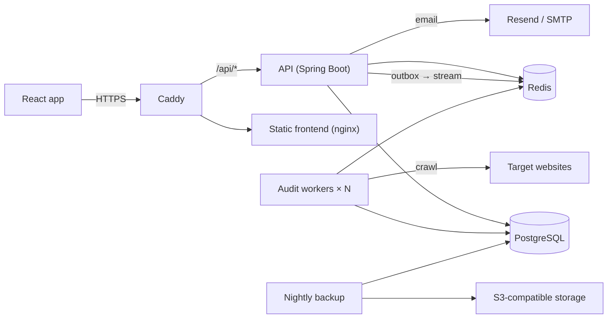

# SEOPulse

**Website SEO audits, from crawl to report.** SEOPulse crawls your websites, scores their on-page SEO health, ranks every issue by impact, and turns each audit into a shareable report, all from one workspace.

[](https://github.com/SunilMaurya-18/SEOPULSE/actions/workflows/ci.yml)
[](https://github.com/SunilMaurya-18/SEOPULSE/actions/workflows/codeql.yml)

```
Connect a website  →  Run or schedule audits  →  Crawl and analyze  →  Review ranked issues and what changed  →  Share the report
```

## Contents

- [Features](#features)
- [Architecture](#architecture)
- [Tech stack](#tech-stack)
- [Repository layout](#repository-layout)
- [Getting started](#getting-started)
- [Configuration](#configuration)
- [API reference](#api-reference)
- [Frontend routes](#frontend-routes)
- [Testing and quality](#testing-and-quality)
- [Deployment](#deployment)
- [Backups and restore](#backups-and-restore)
- [Database migrations](#database-migrations)
- [Troubleshooting](#troubleshooting)
- [Roadmap](#roadmap)

## Features

### Product

- **Free quick check.** Visitors enter a URL on the landing page and get a score and top issues for up to 5 pages, without signing up; nothing is saved, and the result hands the URL straight into sign-up.
- **Websites.** Connect any public HTTP/HTTPS site; URLs are validated and private or internal hosts are refused.
- **Audits.** Queue a crawl and follow it live (`QUEUED → CRAWLING → ANALYZING → COMPLETED`) over Server-Sent Events, with cancellation at any point.
- **On-page analysis.** Titles, meta descriptions, headings, canonicals, links, images, content and HTTP status for every crawled page, plus site-wide checks (HTTPS, sitemap, robots.txt, duplicate titles, broken external links) and social and structured-data signals.
- **Health score.** A weighted 0–100 score per audit with a score per category (content, technical, links, social, performance, security) and a trend chart across audits.
- **Ranked issues.** Issues grouped by rule and severity, each with a recommendation, a "Learn more" link and the affected pages.
- **What changed.** Every issue has a stable fingerprint, so each audit shows new and fixed issues against the previous one, and the issue list badges new issues.
- **Scheduled audits.** Weekly on Pro, daily on Agency, at a chosen hour and timezone. Runs are spread over a 30-minute window and skipped while another audit of the site is running.
- **Alerts.** Score drops, new errors, an unreachable homepage or a failed audit, sent by email (every plan) or to Slack and signed webhooks (Pro and Agency), with retries and a delivery log. Every organization starts with sensible email alerts.
- **Page inventory.** Every crawled URL with its status, title, word count and signals, including redirects and robots-blocked pages.
- **Reports.** Server-rendered PDF reports (white-label on Agency, watermarked on Free), revocable share links that work without an account, a printable HTML report or JSON export, and email delivery. Scheduled audits email a share link to the organization's owners and admins.
- **Data retention.** Page-level details are kept for 30, 180 or 365 days by plan; scores, counts and trends are kept for good.
- **Core Web Vitals.** After each completed audit the homepage is measured with PageSpeed Insights (lab LCP, CLS, TBT, FCP and Speed Index, plus real-user field data when Google has it).
- **Onboarding.** A dismissible dashboard checklist walks new workspaces through adding a site, running an audit, fixing issues and setting up alerts.
- **Workspaces and teams.** Organizations with roles (owner, admin, member), email invitations, and Free, Pro and Agency plans with usage limits, Stripe checkout and Razorpay subscriptions for INR payments.
- **Admin console.** Platform admins get `/admin` with sign-up, workspace and audit stats, user search and unlock, workspace usage and recent failed audits.
- **Interface.** An Apple-inspired dashboard with a floating command-bar navigation, light and dark themes, and a responsive layout down to phones.

### Platform

- **Accounts.** Short-lived JWT access tokens held in memory, rotating `HttpOnly` refresh cookies with reuse detection, email verification, password reset, breached-password checks (Have I Been Pwned, k-anonymity) and account lockout after repeated failures. Optional "Continue with Google" sign-in, throwaway-email blocking and Cloudflare Turnstile CAPTCHA on sign-up and the quick check. Users can download their data or delete their account from Settings.
- **Polite, safe crawler.** Honours robots.txt (RFC 9309) and sitemaps, spaces requests per host, backs off on `429`/`503`, and checks every resolved IP against private and reserved ranges (which also defeats DNS rebinding). Only ports 80 and 443 are allowed.
- **Scalable workers.** Audits flow through a transactional outbox into a Redis Stream; any number of stateless workers consume it with retries, time budgets, stale-job recovery and a stuck-audit reaper.
- **Email outbox.** Verification, reset, lockout, invitation and report emails are queued in Postgres and delivered through Resend or SMTP.
- **Background jobs.** Schedule dispatch, alert delivery, PDF rendering and nightly retention run in the workers, coordinated through ShedLock so each job runs on one worker at a time.
- **Operations.** RFC 9457 problem responses with request IDs, Redis-backed rate limiting, JSON logs, Prometheus metrics, Sentry, health probes, nightly encrypted backups, and zero-touch deploys with automatic rollback.

## Architecture



- **One backend image, two roles.** The API runs with the `prod` profile and workers with `prod,worker`. Locally, the `dev` profile runs both in one process.
- **Audit pipeline.** Creating an audit writes an outbox row in the same transaction. A publisher moves it onto a Redis Stream; a worker claims it, crawls, analyzes, scores and stores the results, and publishes progress over Redis pub/sub, which the API relays to the browser as Server-Sent Events.

```text
QUEUED → CRAWLING → ANALYZING → COMPLETED
   ↘         ↘           ↘
    CANCELLED / FAILED (timeout, retries exhausted, invalid target)
```

## Tech stack

| Layer | Technology |
|---|---|
| Frontend | React 19, TypeScript 6, Vite 8, Tailwind CSS 4, React Router 7, TanStack Query 5, Axios, Lucide, Three.js (landing effects) |
| Backend | Java 25, Spring Boot 4.1, Spring Security (OAuth2 resource server, JWT), Spring Data JPA, Flyway, Jetty HttpClient, jsoup, Bucket4j, ShedLock, OpenHTMLtoPDF, AWS SDK (S3) |
| Data | PostgreSQL 17, Redis 8 (streams, pub/sub, rate limits, robots cache) |
| Integrations | Stripe (billing), Resend or SMTP (email), Sentry (errors) |
| Testing | JUnit 5, Testcontainers, JaCoCo, Vitest, Testing Library, MSW, Playwright |
| Delivery | Docker, Docker Compose, Caddy, GitHub Actions, GHCR, Trivy, CodeQL, Dependabot |

## Repository layout

```
SEOPULSE/
├── seopulse-backend/              Spring Boot API and audit workers
│   ├── src/main/java/com/seopulse/
│   │   ├── auth/                  Registration, login, tokens, verification, reset
│   │   ├── organization/          Organizations, members, invitations
│   │   ├── billing/               Plans, subscriptions, Stripe checkout and webhooks
│   │   ├── project/               Workspaces (projects) and their summaries
│   │   ├── website/               Websites, audits, crawler, SEO analyzers, comparison, worker jobs
│   │   ├── schedule/              Scheduled audits and their dispatcher
│   │   ├── alert/                 Alert rules, evaluation, outbox and delivery (email, Slack, webhooks)
│   │   ├── report/                PDF rendering, report storage, signed downloads, share links
│   │   ├── retention/             Nightly data retention
│   │   ├── notification/          Email outbox and senders (Resend, SMTP, logging)
│   │   ├── user/                  User accounts
│   │   └── common/                Security, errors, rate limiting, metrics, config checks
│   ├── src/main/resources/        application*.yml, Flyway migrations, logging
│   ├── docker-compose.yml         Local Postgres and Redis only
│   └── Dockerfile
├── seopulse-frontend/             React single-page app
│   ├── src/
│   │   ├── api/                   Axios client, endpoints, TanStack Query hooks
│   │   ├── components/            UI primitives, layout (navbar), auth shell, billing
│   │   ├── features/              Dashboard, issues, pages, settings, landing, terms
│   │   ├── pages/                 Route-level screens
│   │   ├── routes/                Router, protected routes, onboarding
│   │   ├── lib/                   Auth, workspace, theme, toasts, report builder
│   │   └── shaders/               Vendored ThreeUI components (landing hero, navbar dock)
│   ├── e2e/                       Playwright smoke test
│   ├── nginx/                     Production nginx config
│   └── Dockerfile
├── deploy/                        Production Compose stack, Caddy, backups, scripts
└── .github/                       CI, deploy, CodeQL and Dependabot
```

## Getting started

### Prerequisites

- **Java 25+** (the Maven wrapper downloads Maven for you)
- **Node.js 20+** and npm
- **Docker Desktop**, for Postgres and Redis (or your own local instances)

### 1. Start Postgres and Redis

```bash
cd seopulse-backend
docker compose up -d
```

This starts PostgreSQL on `localhost:5432` (database, user `seopulse`, password `seopulse_dev_password`) and Redis on `localhost:6379`. It is for local development only; production uses [`deploy/docker-compose.prod.yml`](deploy/docker-compose.prod.yml).

### 2. Configure and run the backend

```bash
cd seopulse-backend
cp src/main/resources/application-local.yml.example src/main/resources/application-local.yml
# Edit application-local.yml and set jwt.secret to a random string of 32+ characters.

./mvnw spring-boot:run          # Windows: .\mvnw.cmd spring-boot:run
```

`application-local.yml` is git-ignored and holds your personal settings (JWT secret, database, and optionally Gmail SMTP). Environment variables work too, for example `JWT_SECRET`.

The API starts on **http://localhost:8082** with the `dev` profile, which also runs the audit worker, applies Flyway migrations, and prints email links to the console.

| URL | What |
|---|---|
| http://localhost:8082/api/v1 | REST API |
| http://localhost:8082/swagger-ui.html | Swagger UI |
| http://localhost:8082/v3/api-docs | OpenAPI JSON |
| http://localhost:8082/api/v1/health | Health check |

### 3. Run the frontend

```bash
cd seopulse-frontend
npm install
cp .env.example .env
npm run dev
```

Open **http://localhost:5173**. Vite proxies `/api` to the backend on port 8082.

### 4. Try it

1. Create an account at `/register` (or paste a URL on the landing page to connect it right after sign-up).
2. A default workspace is created automatically.
3. Add a website under **Websites**, then start a crawl from **Audits** or **New audit** in the navbar.
4. Watch the crawl live, then explore the health score, **Issues** and **Pages**, and download or email the report.

> The crawler only audits public websites; `localhost` and private addresses are refused by design.

## Configuration

Every setting has a safe default in [`application.yml`](seopulse-backend/src/main/resources/application.yml) and can be overridden with an environment variable. Never commit real secrets.

### Profiles

| Profile | Use |
|---|---|
| `dev` (default) | Local development: API and worker in one process, non-secure cookie, CORS for `localhost:5173/5174`, email bodies logged |
| `prod` | API container: JSON logs, management port 8081, strict startup checks |
| `prod,worker` | Worker container: consumes the audit stream (run with `SPRING_FLYWAY_ENABLED=false`) |

The `prod` profile refuses to start with a weak `JWT_SECRET`, the default database password, missing or non-HTTPS `CORS_ALLOWED_ORIGINS` or `SEOPULSE_BOT_INFO_URL`, logged email bodies, or a crawler allowed to reach private networks.

### Backend settings

| Variable | Default | Purpose |
|---|---|---|
| `SERVER_PORT` | `8082` | API port |
| `DB_URL` / `DB_USERNAME` / `DB_PASSWORD` | local dev database | PostgreSQL connection |
| `REDIS_HOST` / `REDIS_PORT` / `REDIS_PASSWORD` | `localhost` / `6379` / empty | Redis connection |
| `JWT_SECRET` | none (required) | HMAC signing key, at least 32 bytes |
| `SEOPULSE_AUTH_ACCESS_TOKEN_TTL` / `SEOPULSE_AUTH_REFRESH_TOKEN_TTL` | `15m` / `30d` | Token lifetimes |
| `SEOPULSE_AUTH_REFRESH_COOKIE_SECURE` | `true` (`false` in `dev`) | `Secure` flag on the refresh cookie |
| `SEOPULSE_AUTH_REQUIRE_EMAIL_VERIFICATION` | `false` | Block audits until the email is verified (currently disabled) |
| `SEOPULSE_AUTH_BREACHED_PASSWORD_CHECK` | `true` | Reject passwords found in known breaches (fails open) |
| `GOOGLE_CLIENT_ID` | empty (off) | OAuth web client ID for "Continue with Google"; use the same value for `VITE_GOOGLE_CLIENT_ID` |
| `SEOPULSE_BLOCK_DISPOSABLE_EMAILS` | `true` | Refuse sign-ups from throwaway email domains |
| `TURNSTILE_SECRET_KEY` | empty (off) | Cloudflare Turnstile secret; when set, sign-up and the quick check require a CAPTCHA token |
| `SEOPULSE_ADMIN_EMAILS` | empty | Comma-separated emails promoted to platform admin at startup and on sign-in |
| `PAGESPEED_API_KEY` / `SEOPULSE_WEB_VITALS_ENABLED` | empty / `true` | PageSpeed Insights key for Core Web Vitals (works without a key at a low shared quota) |
| `SEOPULSE_APP_BASE_URL` | `http://localhost:5173` | Frontend origin used in email links |
| `CORS_ALLOWED_ORIGINS` | `localhost:5173/5174` in `dev` | Comma-separated allowed origins |
| `SEOPULSE_BOT_INFO_URL` | `http://localhost:5173/bot` | Public `/bot` page embedded in the crawler user agent |
| `SEOPULSE_RATE_LIMIT_ENABLED` | `true` | Redis-backed rate limiting |
| `SEOPULSE_WORKER_CONCURRENCY` | `2` | Audits processed in parallel per worker |
| `SENTRY_DSN` / `SENTRY_ENVIRONMENT` / `SENTRY_RELEASE` | empty | Error reporting |
| `MANAGEMENT_PORT` | `8081` in `prod` | Internal health and Prometheus endpoint |

Crawler limits live under `seopulse.crawler.*`: `max-pages` (500), `max-depth` (5), `concurrency`, `min-delay-ms`, `max-crawl-delay-ms`, `max-retries`, `max-duration-minutes` (20), `max-body-size-bytes`, `allowed-ports`, `respect-robots-txt` and `robots-cache-ttl-hours`. External link checks are capped under `seopulse.analysis.external-links.*` (`max-checks` 50, `max-per-host` 3, `budget-seconds` 60).

### Reports, alerts and retention

| Variable | Default | Purpose |
|---|---|---|
| `SEOPULSE_REPORTS_DIR` | `./data/reports` (`/var/lib/seopulse/reports` in the image) | Where PDFs are stored when no bucket is set. The API and workers must share it. |
| `SEOPULSE_REPORTS_S3_BUCKET` / `_REGION` / `_ENDPOINT` / `_PATH_STYLE` | empty / `us-east-1` / empty / `false` | Store PDFs in S3 or an S3-compatible service instead (credentials come from the standard AWS variables) |
| `SEOPULSE_REPORTS_SIGNING_KEY` | derived from `JWT_SECRET` | HMAC key for the 10-minute signed PDF download links |

Other settings under `seopulse.*`: `reports.default-share-days` (30), `reports.max-share-days` (365), `reports.download-url-ttl` (10m), `alerts.dispatch-interval-ms` (10 s), `retention.cron` (`0 15 2 * * *`, UTC), and for the landing-page quick check `quick-check.max-pages` (5), `quick-check.budget` (15s) and `quick-check.max-concurrent` (4 per API instance). Alert deliveries are retried up to six times with backoff (1 min to 6 h). Webhooks must use HTTPS, are never redirected, and are checked against private networks like the crawler.

Webhook requests carry `X-SEOPulse-Event`, `X-SEOPulse-Delivery` and `X-SEOPulse-Signature: t=<unix seconds>,v1=<hex>`, where `v1` is the HMAC-SHA256 of `"<t>.<raw body>"` with the rule's `whsec_…` secret. Reject requests whose `t` is more than five minutes old.

### Email

| Variable | Purpose |
|---|---|
| `RESEND_API_KEY` | Send through [Resend](https://resend.com) (takes precedence over SMTP) |
| `SMTP_HOST` / `SMTP_PORT` / `SMTP_USERNAME` / `SMTP_PASSWORD` | Send over SMTP, e.g. `smtp.gmail.com` / `587` with a [Gmail app password](https://myaccount.google.com/apppasswords) |
| `EMAIL_FROM` | Sender, e.g. `SEOPulse <you@gmail.com>`; Gmail only sends as the signed-in account |

Emails are queued in the `email_outbox` table and sent every 5 seconds. With no provider configured they are only logged (the `dev` profile prints the links). The startup line `Email delivery: ...` shows which sender is active.

### Billing

Set `STRIPE_SECRET_KEY`, `STRIPE_WEBHOOK_SECRET` and the price IDs `STRIPE_PRICE_PRO_MONTHLY`, `STRIPE_PRICE_PRO_YEARLY`, `STRIPE_PRICE_AGENCY_MONTHLY` and `STRIPE_PRICE_AGENCY_YEARLY` to enable checkout. Point the Stripe webhook at `https://<domain>/api/v1/billing/webhook`. Plan limits are stored in the `plans` table:

| Plan | Websites | Pages per audit | Audits per month | Members | Schedules | Slack and webhooks | White-label | Details kept |
|---|---:|---:|---:|---:|---|---|---|---:|
| Free | 3 | 100 | 5 | 1 | none | no | no (watermarked) | 30 days |
| Pro | 10 | 2,000 | 100 | 3 | weekly | yes | no | 180 days |
| Agency | 50 | 10,000 | 1,000 | 15 | daily | yes | yes | 365 days |

**Razorpay (INR, UPI and Indian cards).** Create four subscription plans in the Razorpay dashboard and set `RAZORPAY_KEY_ID`, `RAZORPAY_KEY_SECRET`, `RAZORPAY_WEBHOOK_SECRET`, `RAZORPAY_PLAN_PRO_MONTHLY`, `RAZORPAY_PLAN_PRO_YEARLY`, `RAZORPAY_PLAN_AGENCY_MONTHLY` and `RAZORPAY_PLAN_AGENCY_YEARLY`. Add a webhook at `https://<domain>/api/v1/billing/razorpay/webhook` for the `subscription.*` events (at least `activated`, `charged`, `pending`, `halted`, `cancelled` and `completed`). When both providers are configured, Settings shows a USD/INR switch (INR is preselected for India); with only one, that provider is used. A workspace can only have one paid subscription at a time, and the nightly reconcile refreshes Razorpay subscriptions too.
### Frontend

| Variable | Purpose |
|---|---|
| `VITE_API_BASE_URL` | API base URL, e.g. `http://localhost:8082/api/v1` (production images use the relative `/api/v1`) |
| `VITE_SENTRY_DSN` | Optional browser error reporting |
| `VITE_CONTACT_EMAIL` | Support address shown on the privacy and refund pages (default `support@seopulse.app`) |
| `VITE_GOOGLE_CLIENT_ID` | Shows "Continue with Google" on sign-in and sign-up (same value as `GOOGLE_CLIENT_ID`) |
| `VITE_TURNSTILE_SITE_KEY` | Shows the Turnstile CAPTCHA on sign-up and the quick check (pair with `TURNSTILE_SECRET_KEY`) |

The production Content-Security-Policy in `deploy/Caddyfile` already allows Cloudflare Turnstile, Google Identity Services and Razorpay Checkout.

Production builds fail without `VITE_API_BASE_URL`; see [`.env.production.example`](seopulse-frontend/.env.production.example) for release tagging and Sentry source-map upload.

## API reference

All endpoints live under `/api/v1`. The full, interactive contract is in Swagger UI at `/swagger-ui.html`.

**Conventions**

- Authenticate with `Authorization: Bearer <accessToken>`.
- Errors are RFC 9457 problem responses (`application/problem+json`) with a machine-readable `code` and a `requestId` that matches the `X-Request-Id` header and the server logs.
- Rate limits return `429` with `Retry-After` and `X-RateLimit-*`: login 5/min and 20/hour, register 5/hour, forgot-password 3/hour, audit creation 10/hour per user, landing-page quick checks 5/hour and 15/day per IP plus 10/hour per checked site, everything else 300/min.

| Area | Endpoints |
|---|---|
| **Auth** | `POST /auth/register`, `/auth/login`, `/auth/refresh`, `/auth/logout`, `/auth/logout-all`, `/auth/verify-email`, `/auth/resend-verification`, `/auth/forgot-password`, `/auth/reset-password`, `/auth/google` |
| **Organizations** | `GET, POST /orgs` · `PATCH, DELETE /orgs/{orgId}` · `GET /orgs/{orgId}/members` · `PATCH, DELETE /orgs/{orgId}/members/{userId}` · `GET, POST /orgs/{orgId}/invitations` · `DELETE /orgs/{orgId}/invitations/{id}` · `POST /orgs/invitations/accept` · `POST /orgs/{orgId}/leave` |
| **Billing** | `GET /orgs/{orgId}/billing` · `POST /orgs/{orgId}/billing/checkout` · `POST /orgs/{orgId}/billing/portal` · `POST /billing/webhook` (Stripe) · `POST /orgs/{orgId}/billing/razorpay/subscription`, `/razorpay/verify`, `/razorpay/cancel` · `POST /billing/razorpay/webhook` |
| **Onboarding** | `GET /projects/{projectId}/onboarding` · `POST /onboarding/dismiss` |
| **Admin** (platform admins) | `GET /admin/stats` · `GET /admin/users?q=` · `POST /admin/users/{id}/unlock` · `GET /admin/organizations?q=` · `GET /admin/audits/failed` |
| **Projects** | `GET, POST /projects` · `GET, DELETE /projects/{projectId}` · `GET /projects/{projectId}/summary` |
| **Websites** | `GET, POST /projects/{projectId}/websites` · `GET /projects/{projectId}/websites/{websiteId}` · `GET /…/websites/{websiteId}/trend?limit=30` · `GET, PUT, DELETE /…/websites/{websiteId}/schedule` |
| **Audits** | `GET, POST /projects/{projectId}/audits` · then under `/projects/{projectId}/audits/{auditId}`: `GET` · `GET /summary` · `GET /pages` · `GET /issues` · `POST /cancel` · `POST /email` · `GET /events` (Server-Sent Events) · `GET /compare?baseline=` · `GET /web-vitals` |
| **Reports** | Under `/projects/{projectId}/audits/{auditId}`: `POST, GET /reports` · `POST /reports/{id}/download-url` · `POST, GET /shares` · `DELETE /shares/{id}` |
| **Alerts** | `GET, POST /orgs/{orgId}/alerts` · `PUT, DELETE /orgs/{orgId}/alerts/{id}` · `POST /orgs/{orgId}/alerts/{id}/test` · `POST /orgs/{orgId}/alerts/{id}/rotate-secret` · `GET /orgs/{orgId}/alerts/deliveries` |
| **Branding** | `GET, PUT, DELETE /orgs/{orgId}/branding` |
| **Account** | `GET /account/export` (JSON download) · `POST /account/delete` (requires the current password) |
| **Public** (no auth) | `GET /public/reports/{token}` · `GET /public/reports/{token}/pdf` · `GET /public/report-files/{id}?expires=&sig=` · `POST /public/newsletter/subscribe`, `/public/newsletter/confirm`, `/public/newsletter/unsubscribe` · `POST /public/quick-check` |
| **Health** | `GET /health` |

The refresh token is an `HttpOnly; SameSite=Strict` cookie scoped to `/api/v1/auth`; `refresh` and `logout` also require an `X-Requested-With` header. Presenting an already-rotated refresh token revokes the whole session family.

## Frontend routes

| Route | Screen |
|---|---|
| `/` | Landing page with a free quick check and URL handoff to sign-up |
| `/pricing`, `/terms`, `/bot` | Plans, terms of service, crawler information |
| `/privacy`, `/refund-policy` | Privacy and refund policies |
| `/newsletter/confirm?token=`, `/newsletter/unsubscribe?token=` | Mailing list confirmation and unsubscribe |
| `/login`, `/register` | Sign in and create account |
| `/forgot-password`, `/reset-password?token=`, `/verify-email?token=` | Account recovery and verification |
| `/dashboard` | Workspace overview with KPIs, trends and next steps |
| `/websites` | Connected websites and their audit schedules |
| `/audits`, `/audits/:auditId` | Audit history, live crawl, changes since the last audit, category scores, trend, PDF reports, share links and email |
| `/audits/:auditId/pages`, `/audits/:auditId/issues` | Page inventory and issues for one audit (with New badges and a "new since last audit" filter) |
| `/issues`, `/pages` | Cross-site issue and page explorers |
| `/settings` | Account, theme, sessions, workspace, plan, team, alerts, report branding, data export and account deletion |
| `/admin` | Platform admin console (admins only) |
| `/r/:token` | Public shared report (no sign-in, not indexed) |

Signed-in routes are lazy-loaded behind error boundaries. Server state uses TanStack Query; the access token lives only in memory and a 401 triggers a single shared refresh before requests are retried.

## Testing and quality

### Backend

```bash
cd seopulse-backend
./mvnw verify      # unit and Testcontainers integration tests, JaCoCo coverage gate (needs Docker)
./mvnw package     # build the jar
```

`verify` fails below 60% line coverage on the crawler, SEO analysis, website services and auth.

### Frontend

```bash
cd seopulse-frontend
npm run lint          # Oxlint
npm run typecheck     # tsc -b
npm test              # Vitest, Testing Library and MSW
npm run test:coverage # with V8 coverage
npm run build         # typecheck and production build
npm run test:e2e      # Playwright smoke test
```

The Playwright smoke test registers an account, adds a website, runs a real audit to completion and downloads the report. It needs the backend and worker running with email verification off; install the browser once with `npx playwright install chromium`. Set `E2E_BASE_URL` to test a deployed frontend and `E2E_TARGET_URL` to audit a different public site.

### Continuous integration

| Workflow | Trigger | What it does |
|---|---|---|
| **CI** | Pull requests and `main` | Backend `mvnw verify`; frontend lint, typecheck, tests and build; then the full production stack built from source with the Playwright smoke test through Caddy and a backup/restore drill |
| **Deploy** | Push to `main`, tags `v*` | CI, then images built, Trivy-scanned and pushed to GHCR; `main` deploys to staging, `v*` tags deploy to production after approval |
| **CodeQL** | Pushes, pull requests, weekly | Static security analysis |

Dependabot keeps Maven, npm, Docker and Actions dependencies current.

## Deployment

Production is one Docker Compose stack per server: Caddy (automatic TLS), the static frontend, the API, one or more workers, Postgres, Redis and a nightly backup job. GitHub Actions builds the images, pushes them to GHCR and deploys over SSH.

| File in `deploy/` | Purpose |
|---|---|
| `docker-compose.prod.yml` | The production stack |
| `Caddyfile` | TLS, routing (`/api/*` to the API, everything else to the frontend), HSTS, CSP, compression |
| `.env.example` | Every setting the stack reads; copy to `.env` on the server |
| `scripts/bootstrap-host.sh` | One-time hardening of a fresh Ubuntu 24.04 server |
| `scripts/deploy.sh` | Pull, start, health-check, and roll back on failure |
| `backup/` | Backup image: encrypted `pg_dump` to S3-compatible storage |
| `monitoring/prometheus.yml` | Scrape config for the optional monitoring profile |
| `docker-compose.ci.yml`, `ci.env` | The same stack built from source on `https://localhost`, for CI and local testing |

**Report storage.** PDF reports are written to the `reports_data` volume, mounted on both the API and the workers. To run them on separate hosts, set `REPORTS_S3_BUCKET` (and credentials) in `.env` so both sides use S3 instead.

**Network layout.** Only Caddy publishes ports (80, 443 and 443/udp). Postgres and Redis sit on an internal network with no internet route; workers and backups reach the internet through a separate egress network. Actuator listens on port 8081 inside the containers and is never routed by Caddy. Only the API runs Flyway migrations, and workers start once it is healthy.

<details>
<summary><b>One-time server setup</b></summary>

Use Ubuntu 24.04 LTS with about 4 vCPU, 8 GB RAM and 80 GB SSD. Staging should be its own smaller server (2 vCPU, 4 GB), since each stack's Caddy needs ports 80 and 443.

1. **DNS.** Point an A (and AAAA) record, e.g. `app.example.com`, at the server. Caddy requests the certificate on first start.
2. **Snapshots.** Turn on the provider's automatic backups as a second layer behind the nightly dumps.
3. **Harden the host.** Copy `deploy/scripts/bootstrap-host.sh` to the server and run it as root:

   ```bash
   ADMIN_USER=you \
   ADMIN_SSH_KEY="ssh-ed25519 AAAA... you@laptop" \
   DEPLOY_SSH_KEY="ssh-ed25519 AAAA... github-deploy" \
   bash bootstrap-host.sh
   ```

   It installs Docker with log rotation, creates a sudo admin and a `deploy` user for CI, disables password and root SSH login, enables UFW (22, 80, 443), fail2ban and unattended upgrades, and creates `/opt/seopulse`. Keep the root session open until `ssh you@<server>` works from a new terminal.

4. **Configure the stack.**

   ```bash
   scp deploy/.env.example you@<server>:/tmp/seopulse.env
   ssh you@<server>
   sudo install -o deploy -g deploy -m 600 /tmp/seopulse.env /opt/seopulse/.env && rm /tmp/seopulse.env
   sudo -u deploy nano /opt/seopulse/.env
   ```

   Generate secrets with `openssl rand -base64 48`, set `IMAGE_REGISTRY=ghcr.io/<owner-in-lowercase>`, and put only the **public** backup key in `BACKUP_AGE_RECIPIENT` (see [Backups and restore](#backups-and-restore)).

5. **Record the host key for CI:** store the output of `ssh-keyscan -t ed25519 <server>` in the environment's `DEPLOY_KNOWN_HOSTS` secret.

</details>

<details>
<summary><b>GitHub setup</b></summary>

1. **Environments.** Create `staging` and `production` under *Settings → Environments*; add yourself as a required reviewer on `production`, and optionally restrict it to `v*` tags.
2. **Environment secrets:** `DEPLOY_HOST`, `DEPLOY_USER` (`deploy`), `DEPLOY_SSH_KEY` (private key matching the bootstrap key) and `DEPLOY_KNOWN_HOSTS`.
3. **Environment variables:** `APP_URL` (e.g. `https://staging.example.com`); optionally `DEPLOY_PATH` (default `/opt/seopulse`) and `DEPLOY_SSH_PORT` (default 22).
4. **Frontend Sentry (optional):** repository variables `VITE_SENTRY_DSN`, `SENTRY_ORG`, `SENTRY_PROJECT` and secret `SENTRY_AUTH_TOKEN`. Set `VITE_CONTACT_EMAIL` too, so the legal pages show your support address, and `VITE_GOOGLE_CLIENT_ID` / `VITE_TURNSTILE_SITE_KEY` to turn on Google sign-in and the CAPTCHA.
5. **Security:** enable Dependabot alerts and code scanning under *Settings → Code security*.

</details>

### Releases and rollback

| Trigger | Result |
|---|---|
| Push to `main` | Images tagged with the commit SHA and `main`, deployed to **staging** |
| Tag `v*` (e.g. `v1.0.0`) | Images also tagged `1.0.0`, deployed to **production** after approval |

Until an environment's secrets and `APP_URL` are set, staging deploys are skipped with a warning and production deploys fail, naming what is missing.

A deploy uploads the Compose file, `Caddyfile`, `monitoring/` and `scripts/deploy.sh` (never `.env`), then runs `deploy.sh <sha>`: it pulls, starts the stack and waits for every health check, probes `/api/v1/health` and `/` through Caddy, and redeploys the previous tag if anything fails. To roll back by hand:

```bash
cd /opt/seopulse && ./scripts/deploy.sh --rollback
```

Rollback swaps images only; migrations are not undone, which is why every migration must stay backward compatible (see [Database migrations](#database-migrations)).

### Operations

All commands run in `/opt/seopulse`, with `export IMAGE_TAG=$(cat .deployed-tag)` and `dc` as short for `docker compose -f docker-compose.prod.yml --env-file .env`.

| Task | Command |
|---|---|
| Status | `dc ps` |
| Logs (JSON lines) | `dc logs -f --tail 100 api worker` |
| Scale workers | Set `WORKER_REPLICAS=3` in `.env`, then `dc up -d --wait` |
| Back up now | `dc exec backup backup.sh` |
| List backups | `dc exec backup restore.sh list` |
| Postgres shell | `dc exec postgres psql -U seopulse seopulse` |
| Prometheus and Grafana | `dc --profile monitoring up -d`, then tunnel ports 3000 and 9090 over SSH |

**Monitoring.** Add uptime checks on `https://<domain>/api/v1/health` and `https://<domain>/`, a 24-hour heartbeat monitor for `BACKUP_HEARTBEAT_URL`, and `SENTRY_DSN` / `VITE_SENTRY_DSN` for errors (frontend events carry the backend `requestId`). Useful metrics: `audits_started_total`, `audits_completed_total`, `audit_duration_seconds`, `crawl_pages_total`, `outbox_lag_seconds` and `redis_stream_pending`.

**Scaling.** Stay on one server until CPU stays above 70%, queue lag exceeds 10 minutes at peak, or the database passes 50 GB. Then move to managed Postgres, managed Redis, and workers on a second server, in that order; workers are stateless and scale horizontally.

### Run the production stack locally

This is what CI runs, served on `https://localhost:18443` with a local certificate. Drive it from Playwright rather than your own browser, since its HSTS header would then apply to every `localhost` port.

```bash
export COMPOSE_FILE=deploy/docker-compose.prod.yml:deploy/docker-compose.ci.yml
export COMPOSE_ENV_FILES=deploy/ci.env COMPOSE_PROJECT_NAME=seopulse-ci

BACKUP_AGE_RECIPIENT=not-used-at-build-time docker compose build
export BACKUP_AGE_RECIPIENT=$(docker run --rm --entrypoint age-keygen seopulse-ci/seopulse-backup:ci 2>&1 | grep -m1 'public key' | awk '{print $4}')
docker compose up -d --wait --wait-timeout 300

cd seopulse-frontend && E2E_BASE_URL=https://localhost:18443 E2E_IGNORE_HTTPS_ERRORS=1 npx playwright test
cd .. && docker compose down -v --remove-orphans
```

## Backups and restore

Two layers protect the data:

1. **Nightly database dumps.** At `BACKUP_TIME` (02:30 UTC by default) the `backup` container runs `pg_dump -Fc`, encrypts it with [age](https://age-encryption.org) and uploads it to S3-compatible storage under `daily/`, copying Sunday dumps to `weekly/` and first-of-month dumps to `monthly/`. It keeps 7 daily, 4 weekly and 6 monthly copies.
2. **Provider snapshots** of the whole server, for when the host itself is lost.

Redis only holds the queue and rate-limit counters, so it is not backed up; audits in flight during a restore are marked failed and can be re-run.

**Encryption key.** Create the key pair once on your own machine with `age-keygen -o seopulse-backup.key`. Put the `age1...` public key in `BACKUP_AGE_RECIPIENT`, and keep the private key in your password manager plus an offline copy. **Without it no backup can be restored.** Use a bucket-scoped access key and enable object lock or versioning if your provider supports it.

<details>
<summary><b>Restore into a scratch database (safe, no downtime)</b></summary>

```bash
cd /opt/seopulse
export IMAGE_TAG=$(cat .deployed-tag)
dc="docker compose -f docker-compose.prod.yml --env-file .env"

scp seopulse-backup.key you@<server>:/tmp/age-identity   # from your machine
chmod 644 /tmp/age-identity

$dc run --rm --no-deps -v /tmp/age-identity:/run/secrets/age-identity:ro \
  --entrypoint restore.sh backup latest seopulse_restore     # or e.g. monthly/seopulse-20260901T023000Z.dump.age

$dc exec postgres psql -U seopulse -d seopulse_restore -c 'SELECT count(*) FROM users'

shred -u /tmp/age-identity
$dc exec postgres dropdb -U seopulse seopulse_restore
```

</details>

<details>
<summary><b>Restore the live database</b></summary>

This replaces all current data; everything written since the backup is lost.

1. Announce downtime and stop the writers: `$dc stop api worker`.
2. Take a safety dump first: `$dc exec backup backup.sh`.
3. Copy the private key to `/tmp/age-identity` as above, then drop and restore:

   ```bash
   $dc exec postgres dropdb -U seopulse --force seopulse
   $dc run --rm --no-deps -v /tmp/age-identity:/run/secrets/age-identity:ro \
     --entrypoint restore.sh backup latest seopulse
   shred -u /tmp/age-identity
   ```

4. Start again (Flyway applies any newer migrations) and check: `$dc up -d --wait && curl -fsS https://<domain>/api/v1/health`.

To rebuild on a new server: run the [server setup](#deployment) with the saved `.env`, point DNS at it, redeploy the last good SHA, then restore the live database. Target: back online within an hour, losing at most a day of data.

</details>

<details>
<summary><b>Monthly restore drill</b></summary>

On the first working day of each month, restore last night's production backup into **staging** and record the date, backup used, duration and row counts.

1. On staging, create `/opt/seopulse/restore-drill.env` with the production bucket settings (`BACKUP_S3_BUCKET`, `BACKUP_S3_PREFIX`, `BACKUP_S3_ENDPOINT`, `BACKUP_S3_REGION`, and a read-only key pair).
2. Copy the private key to `/tmp/age-identity`, then:

   ```bash
   cd /opt/seopulse && export IMAGE_TAG=$(cat .deployed-tag)
   dc="docker compose -f docker-compose.prod.yml --env-file .env --env-file restore-drill.env"
   $dc stop api worker
   $dc exec postgres dropdb -U seopulse --force seopulse
   $dc run --rm --no-deps -v /tmp/age-identity:/run/secrets/age-identity:ro \
     --entrypoint restore.sh backup latest seopulse
   shred -u /tmp/age-identity
   docker compose -f docker-compose.prod.yml --env-file .env up -d --wait
   ```

3. Sign in with a production account, open a recent audit, and compare `users` and `audits` row counts with production.
4. Staging now holds production data: restrict access until the next deploy, and delete `restore-drill.env`.

CI runs a smaller drill on every pull request against a MinIO bucket.

</details>

## Database migrations

The schema is owned by Flyway (`seopulse-backend/src/main/resources/db/migration`); Hibernate only validates it.

| Version | Purpose |
|---|---|
| V1 | Baseline schema |
| V2 | Crawler redirects, final URLs and skip reasons |
| V3 | Refresh, verification and reset tokens; lockout; cancelled audits |
| V4 | Organizations, members, invitations, audit log |
| V5 | Projects moved under organizations |
| V6 | Plans, subscriptions, Stripe events, usage counters |
| V7 | Email outbox, terms acceptance, locked websites |
| V8 | Audit schedules, alert rules and alert outbox, ShedLock, plan features (schedules, webhooks, white-label, retention) |
| V9 | Rule catalog with categories and help links, issue fingerprints, page signals, weighted category scores, audit aggregates |
| V10 | PDF reports, share links, organization branding |
| V11 | Free plan allows 3 websites |
| V12 | Newsletter subscribers with double opt-in |
| V13 | Dismissible onboarding checklist |
| V14 | Google sign-in subject on users |
| V15 | Core Web Vitals per audit |
| V16 | Razorpay subscriptions and billing provider |

Rules for every migration:

- Never edit a migration after it has run in staging or production; add a new one.
- Keep each release backward compatible with the previous one: add and backfill first, and drop old columns only in a later release.
- Every migration must pass the empty-database Testcontainers test.

## Troubleshooting

| Problem | Fix |
|---|---|
| Backend fails with `JWT_SECRET` / `jwt.secret` missing | Set `jwt.secret` in `application-local.yml` or export `JWT_SECRET` (32+ characters) |
| "Workspace unavailable" or 401 everywhere | Make sure the API is on port `8082` (not another process on `8080`) and sign in again |
| Signed out after every reload | Run the `dev` profile (non-secure cookie) and keep the frontend and API on the same site, e.g. both on `localhost` |
| Cannot add a website, or "hostname could not be resolved" | Use a public, resolvable `https://` URL; private and local hosts are refused |
| Emails never arrive | Check the `Email delivery: ...` startup line and `Email delivery failed` warnings; Gmail needs an app password, not your normal password |
| "Verify your email" when starting an audit | Verification is on: use the emailed link (or the one printed in the `dev` console), or set `SEOPULSE_AUTH_REQUIRE_EMAIL_VERIFICATION=false` |
| `429 Too Many Requests` | Wait for `Retry-After`, or set `SEOPULSE_RATE_LIMIT_ENABLED=false` locally |
| Frontend ignores `.env` changes | Restart `npm run dev` |
| `localhost:5173` suddenly redirects to HTTPS | The local production stack set HSTS for `localhost`; clear it at `chrome://net-internals/#hsts` |
| Caddy keeps restarting in production | `docker compose logs caddy`; check `ACME_EMAIL`, `APP_DOMAIN` and DNS |

## Roadmap

- **Retention (done):** scheduled audits, alerts (email, Slack, webhooks), issue trends and fingerprints, branded PDF reports and share links, data retention.
- **Growth:** Google Search Console and GA4, Core Web Vitals, JavaScript rendering, a public API, AI fix suggestions, an admin console, and GDPR tooling.

## License

No license has been granted yet; all rights reserved by the author.
