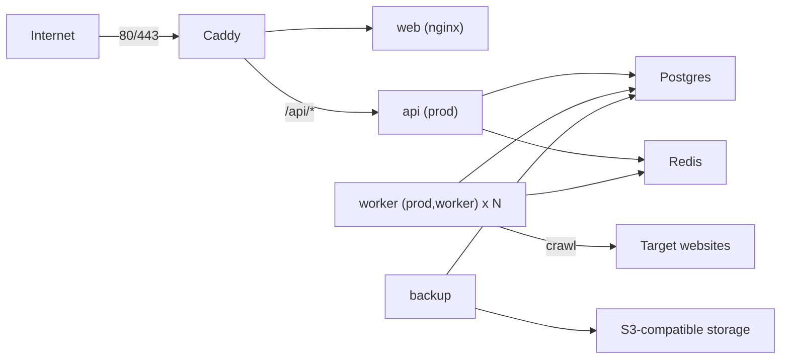

# Deploying SEOPulse

Production runs as one Docker Compose stack per server: Caddy (TLS), the static frontend, the API, one or more audit workers, Postgres, Redis and a nightly backup job. GitHub Actions builds the images, pushes them to GHCR and deploys over SSH.

| File | Purpose |
|---|---|
| `docker-compose.prod.yml` | The production stack |
| `Caddyfile` | TLS, routing (`/api/*` to the API, everything else to the frontend), HSTS, CSP, compression, body size limit |
| `.env.example` | Every setting the stack reads; copy to `.env` on the server |
| `scripts/bootstrap-host.sh` | One-time hardening of a fresh Ubuntu 24.04 server |
| `scripts/deploy.sh` | Pull, start, health-check, and roll back on failure |
| `backup/` | The backup image: encrypted `pg_dump` to S3-compatible storage |
| `RESTORE.md` | How to restore a backup, and the monthly drill |
| `monitoring/prometheus.yml` | Scrape config for the optional monitoring profile |
| `docker-compose.ci.yml`, `ci.env` | Runs the same stack locally or in CI, built from source, on `https://localhost` |

`seopulse-backend/docker-compose.yml` is different: it only starts Postgres and Redis for local development, where the API and worker run from your IDE or `mvnw`.

## Architecture



- Only Caddy publishes ports (80, 443 and 443/udp for HTTP/3).
- Postgres and Redis are on an `internal` network with no internet route. The worker and backup get outbound access through a separate `egress` network, and the API through `edge`.
- The API runs Flyway migrations on startup. Workers have `SPRING_FLYWAY_ENABLED=false` and only start once the API is healthy.
- Actuator (health and Prometheus) listens on port 8081 inside the containers and is never routed by Caddy.
- The frontend image calls the API at the relative path `/api/v1`, so the same image serves staging and production.

## One-time server setup

Use Ubuntu 24.04 LTS with about 4 vCPU, 8 GB RAM and 80 GB SSD (for example Hetzner CPX31 or an 8 GB DigitalOcean droplet). Staging should be its own smaller server (2 vCPU / 4 GB is enough): each stack's Caddy needs ports 80 and 443 to itself.

1. **DNS.** Point an A (and AAAA) record for the domain, for example `app.example.com` or `staging.example.com`, at the server. Caddy requests the certificate on first start, so DNS must resolve first.
2. **Provider snapshots.** Turn on the provider's automatic backups or snapshots. They are the second layer behind the nightly database backups.
3. **Harden the host.** Copy `scripts/bootstrap-host.sh` to the server and run it as root:

   ```bash
   ADMIN_USER=sunil \
   ADMIN_SSH_KEY="ssh-ed25519 AAAA... you@laptop" \
   DEPLOY_SSH_KEY="ssh-ed25519 AAAA... github-deploy" \
   bash bootstrap-host.sh
   ```

   It installs Docker with log rotation, creates a sudo admin user and a `deploy` user for CI, disables password and root SSH login, enables UFW (22, 80, 443 only), fail2ban and unattended security upgrades, and creates `/opt/seopulse`. Keep the root session open until you have confirmed `ssh sunil@<server>` works from a new terminal.

4. **Configure the stack.** Copy the example from this repo and fill it in on the server:

   ```bash
   scp deploy/.env.example sunil@<server>:/tmp/seopulse.env
   ssh sunil@<server>
   sudo install -o deploy -g deploy -m 600 /tmp/seopulse.env /opt/seopulse/.env && rm /tmp/seopulse.env
   sudo -u deploy nano /opt/seopulse/.env
   ```

   Generate secrets with `openssl rand -base64 48`. Set `IMAGE_REGISTRY=ghcr.io/<github-owner-in-lowercase>`. Create the backup key pair as described in [RESTORE.md](RESTORE.md#backup-encryption-key) and put only the **public** key in `BACKUP_AGE_RECIPIENT`.

5. **Record the host key for CI.** From your machine, run `ssh-keyscan -t ed25519 <server>` and store the output in the environment's `DEPLOY_KNOWN_HOSTS` secret.

The first deploy is done by the pipeline. There is no previous tag to roll back to, so if it fails, fix the cause and re-run the job.

## GitHub setup

1. **Environments.** In *Settings > Environments*, create `staging` and `production`. On `production`, add yourself under *Required reviewers*; that is the manual approval gate. Optionally restrict `production` to `v*` tags under *Deployment branches and tags*.
2. **Environment secrets** (per environment):

   | Secret | Value |
   |---|---|
   | `DEPLOY_HOST` | Server hostname or IP |
   | `DEPLOY_USER` | `deploy` |
   | `DEPLOY_SSH_KEY` | Private key matching `DEPLOY_SSH_KEY` from the bootstrap step |
   | `DEPLOY_KNOWN_HOSTS` | Output of `ssh-keyscan -t ed25519 <server>` |

3. **Environment variables:** `APP_URL` (for example `https://staging.example.com`). Optional: `DEPLOY_PATH` (default `/opt/seopulse`) and `DEPLOY_SSH_PORT` (default 22).
4. **Repository variables and secrets** for frontend Sentry (all optional): variables `VITE_SENTRY_DSN`, `SENTRY_ORG`, `SENTRY_PROJECT`; secret `SENTRY_AUTH_TOKEN` to upload source maps.
5. **Security.** Enable Dependabot alerts and code scanning (the CodeQL workflow uploads results) under *Settings > Code security*.

## How deploys work

| Trigger | What happens |
|---|---|
| Pull request | `ci.yml`: backend `mvn verify` (tests + coverage gate), frontend lint/typecheck/test/build, then the production stack built from source with the Playwright smoke test through Caddy and a backup/restore drill |
| Push to `main` | `deploy.yml`: CI, then three images built, scanned with Trivy (fails on fixable critical CVEs) and pushed to GHCR tagged with the commit SHA and `main`, then deployed to **staging** |
| Tag `v*` (e.g. `v0.1.0`) | CI, images (also tagged `0.1.0`), then **production** after a reviewer approves |

A deploy uploads `docker-compose.prod.yml`, `Caddyfile`, `monitoring/` and `scripts/deploy.sh` to the server (never `.env`), logs the server in to GHCR with the job's short-lived token, and runs `scripts/deploy.sh <sha>`:

1. `docker compose pull` and `up -d --remove-orphans --wait`, which waits for every health check (API readiness includes Postgres and Redis).
2. A request to `/api/v1/health` and `/` through Caddy on the server itself.
3. If either step fails, it redeploys the previously deployed tag and the job fails.

The last two successful tags are kept in `.deployed-tag` and `.previous-tag`. To roll back by hand:

```bash
cd /opt/seopulse && ./scripts/deploy.sh --rollback
```

Rollback swaps images only; Flyway migrations are not undone. That is why migrations must stay backward compatible with the previous release (see the migration rules in `IMPLEMENTATION.md`).

## Day-to-day operations

All commands run in `/opt/seopulse`. `dc` is short for `docker compose -f docker-compose.prod.yml --env-file .env`, and `IMAGE_TAG=$(cat .deployed-tag)` must be exported first.

| Task | Command |
|---|---|
| Status | `dc ps` |
| Logs (JSON, one object per line) | `dc logs -f --tail 100 api worker` |
| Scale workers | Set `WORKER_REPLICAS=3` in `.env`, then `dc up -d --wait` |
| Run a backup now | `dc exec backup backup.sh` |
| List backups | `dc exec backup restore.sh list` |
| Postgres shell | `dc exec postgres psql -U seopulse seopulse` |
| Start Prometheus + Grafana | `dc --profile monitoring up -d`, then `ssh -L 3000:localhost:3000 -L 9090:localhost:9090 <server>` |

Container logs rotate at 10 MB x 5 files per container, both in the Compose file and in the Docker daemon defaults.

## Monitoring and alerts

- **Uptime.** In Better Stack or UptimeRobot, add an HTTP monitor on `https://<domain>/api/v1/health` (expects 200) and one on `https://<domain>/` (expects 200), each checking every minute, with alerts to email and Slack. Add the same for staging with lower urgency.
- **Backup heartbeat.** Create a heartbeat monitor that expects a ping every 24 hours (with some grace) and set its URL as `BACKUP_HEARTBEAT_URL`. A missing ping means last night's backup failed.
- **Errors.** Set `SENTRY_DSN` in `.env` for the API and worker, and the `VITE_SENTRY_DSN` repository variable for the frontend. Frontend events carry the backend's `X-Request-Id` as the `request_id` tag, which matches the `requestId` field in the JSON logs.
- **Metrics.** The `monitoring` profile runs Prometheus (scraping the API and every worker replica on port 8081) and Grafana, both bound to `127.0.0.1`. Add Prometheus as a Grafana data source at `http://prometheus:9090`. The useful series are `audits_started_total`, `audits_completed_total`, `audit_duration_seconds`, `crawl_pages_total`, `outbox_lag_seconds` and `redis_stream_pending`. Grafana Cloud's free tier with Grafana Alloy scraping the same targets is an alternative that also works when the server is down.

## Checking the exit criteria

- **HTTPS staging on merge:** push to `main` and watch the `Deploy` workflow finish with a green `Deploy to staging` job and a valid certificate on `https://staging.<domain>`.
- **Production on tag with rollback:** `git tag v0.1.0 && git push origin v0.1.0`, approve the deployment, and confirm the site. To exercise the rollback path on staging, run `./scripts/deploy.sh does-not-exist` on the server: the pull fails, the script logs `rolling back to <current sha>`, and the site stays up. For an unhealthy-container failure, deploy a new SHA with `DEPLOY_WAIT_TIMEOUT=5 ./scripts/deploy.sh <sha>`: the API cannot become ready in 5 seconds, so the script rolls back (the rollback itself uses the normal timeout).
- **Restore:** follow the drill in [RESTORE.md](RESTORE.md#monthly-restore-drill).
- **Open ports:** from a machine outside the server's network, `nmap -Pn -p- <server-ip>` should list only 22, 80 and 443 as open.

## When to move off a single VPS

Stay on one server until one of these holds for more than a few days:

- sustained CPU above 70%,
- audit queue lag (`outbox_lag_seconds`, or the oldest pending audit) above 10 minutes at peak,
- database size above 50 GB, or backups and restores taking longer than your recovery-time target.

The next steps, in order:

1. **Managed Postgres** (DigitalOcean, Hetzner, Neon, RDS). Point `DB_URL` at it and drop the `postgres` and `backup` services in favour of the provider's point-in-time recovery.
2. **Managed Redis** (or Valkey) with persistence. Point `REDIS_HOST`/`REDIS_PASSWORD` at it.
3. **Workers on a second VPS.** Run the same image with `SPRING_PROFILES_ACTIVE=prod,worker` and the same `.env` minus Caddy; workers are stateless and scale horizontally because each one picks a unique Redis consumer name.
4. Only after that, a load balancer and a second API instance. The API is stateless apart from the scheduled cleanup jobs, which would then need a lock (ShedLock arrives in Phase 5).
